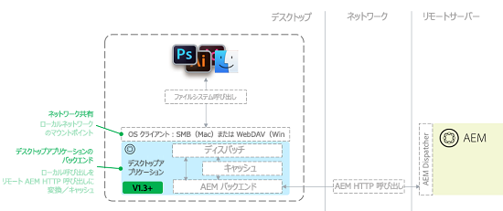

# AEMデスクトップアプリケーションv1.xのベストプラクティス {#aem-desktop-app-best-practices}

## 概要 {#overview}

Adobe Experience Manager (AEM)デスクトップアプリは、Digital Asset Management(DAM)ソリューションをデスクトップにリンクし、AEM Web UIで使用できるファイルをデスクトップ上で直接開くことができます。 アセットをデスクトップから保存すると、AEMの適切な場所にアップロードされます。

AEMデスクトップアプリケーションを使用すると、AEMで誤ったローカルコピーを更新したり、間違ったアセットを更新したりする可能性がなくなります。 デスクトップアプリケーションの使いやすいワークフローは、デスクトップオペレーティングシステムが提供するネットワーク共有テクノロジーを使用して有効になります。

デスクトップアプリケーションは、AEM Assetsリポジトリをネットワーク共有としてデスクトップにマウントします。 このため、フォルダーとファイルはローカルのフォルダーとファイルのように表示されます。しかし、Finder やエクスプローラーを使用し、デスクトップ上にマウントされたネットワーク共有で直接デジタルアセット管理の作業をおこなうことは推奨されていません。代わりに、多数のアセットのコピーや移動には AEM Assets の Web UI を利用して作業することを推奨します。

>[!NOTE]
>
>このドキュメントを読む前に、[AEM と Creative Cloud の統合のベストプラクティス](https://docs.adobe.com/content/help/en/experience-manager-64/assets/administer/aem-cc-integration-best-practices.html)全体をよく読むと、このトピックについて概要を把握することができます。

## AEM desktop app architecture {#aem-desktop-app-architecture}

AEMデスクトップアプリケーションは、WebDAV(Windows)またはSMB(Mac)のネットワーク共有を使用してネットワーク共有をマウントします。 マウントするネットワーク共有はローカルのみです。AEMデスクトップアプリは呼び出し（開く、読み取り、書き込み）を傍受し、追加のローカルキャッシュを提供します。 AEM Assets サーバーへのリモートコールを最適化された AEM HTTP 要求に変換します。次の図は、AEMデスクトップアプリケーションのアーキテクチャを示しています。

ファイルを保存する際の write における追加のキャッシングでは、（ネットワーク通信でユーザーを待たせないよう）ファイルは先にローカルに保存されます。その後、事前定義された時間（30 秒）の経過後、バックグラウンドでファイルが AEM にアップロードされ、アセットが AEM にアップロードされます。AEMデスクトップアプリでは、バックグラウンドファイルのアップロードのステータスを監視するUIが提供されます。

## Recommended use of AEM desktop app {#recommended-use-of-aem-desktop-app}

AEMデスクトップアプリの主な機能は次のとおりです。

* デスクトップでAEM Assets Web UIからファイルを開く：Web UIから、デスクトップ上（Finder、エクスプローラー）でアセットを表示したり、デスクトップアプリケーションを使用してアセットを開いたりできます。
* チェックアウトおよびチェックイン。アセットはチェックアウトして編集することが可能で、AEM Assets のユーザーにはロック済みとして表示されます。編集後に、アセットをチェックインすればロックが解除されます。
* ファイルへの変更を保存する。ネットワーク共有内でファイルに保存した変更内容は、AEM へ自動的にアップロードされ、新たなバージョンが作成されます。
* リンクされたアセットを他のドキュメントに配置する：Creative Cloud（PS、ID、AIなど）などのアプリケーションでは、外部ファイルをリンクとして配置できます（例えば、InDesignドキュメントに画像を配置できます）。 この場合、ネットワーク共有マウントを使用して、AEMから配置するアセットを参照して選択できます。 MS Office など、アドビ以外のアプリでもリンクしたファイルを配置することができるものがあります。
* AEMでの参照解像度：配置したファイルとリンクを含むメインファイルの両方がAEMに保存されている場合、アセット参照に関するサーバー側の情報を自動的に提供できます。
* デスクトップからアセットにアクセスします。マウントされたネットワーク共有では、コンテキストメニューにより、詳細ダイアログ（大きいプレビュー、キーメタデータ）と、AEM UIでアセットを開く機能が提供されます。
* 大きな階層フォルダーを一括でアップロードする：AEM UIで作成/フォルダーのアップロードオプションを使用してアセットをアップロードする場合、AEMデスクトップアプリは選択したフォルダー階層をバックグラウンドでAEMにアップロードします。 デスクトップアプリの専用 UI でアップロードの進捗を監視することができます。

## Inappropriate use of AEM desktop app {#inappropriate-use-of-aem-desktop-app}

* AEMデスクトップアプリを使用してデスクトップからアセットを管理しないでください。 AEMデスクトップアプリは、ネットワークドライブの代わりとして構築されませんでした。 代わりに次の機能を使用してください。
   * デジタルアセット管理（アセットの検索/共有、メタデータ、コピー/移動など）用のAEM Assets Web UI
   * AEMデスクトップアプリのフォルダーをアップロードして、大きな階層フォルダーをアップロード

* AEMデスクトップアプリは、AEM Assetsの「デスクトップ同期」クライアントとして扱わないでください。 ここでのAEMデスクトップアプリケーションの主な利点は、リポジトリ全体に対して「仮想」アクセスを提供し、デスクトップ同期アプリケーションは通常、1人のユーザーに属するアセットのみを同期する点です。 AEMデスクトップアプリは、ある程度のキャッシュとバックグラウンドアップロードを提供します。ただし、Adobe Creative cloudデスクトップアプリケーションやMicrosoft oneDriveなどの一般的な「同期」アプリケーションとは大きく異なる動作をします。
* AEMデスクトップアプリケーションのネットワークドライブを使用してアセットを頻繁に保存しないでください。 AEM Assets にはすべての保存作業が送信されます。このため、マウントされた AEM Assets リポジトリで集中的な編集作業を直接おこなうのは実用的ではありません。マウントされたリポジトリで直接アセットを編集すると、アセットのタイムラインに不要なバージョンを詰め込み、サーバーに余分なオーバーヘッドを課すことになります。
* AEMインスタンス間で大量のデータを移行する場合は、AEMデスクトップアプリケーションを使用しないでください。 アセット移行の計画と実行については、[移行ガイド](https://helpx.adobe.com/experience-manager/6-4/assets/using/assets-migration-guide.html)を参照してください。In contrast, desktop app [supports bulk uploading](use-app-v1.md#bulkupload) large number of assets for the first time in AEM.

## 一部の使用例に関するレコメンデーション {#recommendations-for-selected-use-cases}

### クリエイティブユーザーのアセットへのアクセス {#access-to-assets-for-creative-users}

AEMデスクトップアプリケーションは、DAMリポジトリ全体に仮想アクセスを提供します。クリエイティブユーザーがデスクトップで適切なアセットを見つけてアクセスするのは複雑な場合があります。 次のベストプラクティスを使用し、クリエイティブユーザーの作業を簡易化できます。

* AEM Assets Web UI の共同作業機能を使用して、クリエイティブユーザーがより直接的に適当なアセットにアクセスできるようにします。フォルダーやコレクションの共有、スマートコレクション（保存済み検索結果）の提供あるいは適切なアセットを示唆する通知の送信などの機能が利用できます。クリエイティブユーザーは、Web UI でデスクトップアクションを利用すると、デスクトップからアセットに簡単にアクセスすることができます。
* DAM リポジトリを表示するビューを簡易化するため、クリエイティブユーザーのアセットへの適切な権限（アクセス制御）を考慮し、基本的には、ユーザーが必要とするまたは興味を持つアセットのみにアクセスできるよう制限します。

   * クリエイティブユーザーに無関係の領域については、ユーザーグループに制限をかけ、ユーザーのビューまたはデスクトップから削除します。
   * DAM 内のアセットの多くは確定していて変更されるべきではないので、クリエイティブユーザーには読み取り専用にします。
   * 変更あるいは修正が必要なアセットのみクリエイティブユーザーの書き込みを有効にします。作成した AEM プロジェクトとフォルダーを利用して、まだ変更される可能性のあるアセットを保存する組織もあります。

### アセットの検索 {#searching-assets}

デスクトップで開くファイルを検索するには：

* AEM Assets の Web UI を利用してアセットを見つけます。AEM Assets の  は、強力なAEM Assetsでの検索（検索ファセット、保存済みの検索）であり、適切なアセットを見つける追加機能も提供します。 これには、ステータス（承認、有効期限満了）、コレクション、タスク、通知、他のユーザー／グループとのフォルダー／コレクションの共有に基づいてアセットを検索する機能など追加のフィルターなどが含まれます。
* アセットを見つけたら、AEM UI のデスクトップアクションを使用して  デスクトップ .

### Updating assets opened using AEM desktop app {#updating-assets-opened-using-aem-desktop-app}

AEM Assets からローカルネットワーク共有にマップされた場所でアセットを直接編集すると、デスクトップで保存するたびにアセットが AEM にアップロードされます。さらに、AEM はバージョンとレンディションを生成します。

AEM に保存されたアセットを更新する必要がある場合：

* For **minor updates**, such as minor retouching requests in the approval process:

   * ファイルをチェックアウトし、デスクトップで開きます。
   * ファイルを更新します。
   * 更新したバージョンを保存します。アセットは更新され、タイムラインには比較のため元のバージョンも表示されます。

* For **major updates**, such as a change request that requires a small creative WIP cycle:

   * 表示オプションを利用し、デスクトップで適切なフォルダーを開きます。
   * マップされたAEM Assets共有以外のWIPフォルダーにファイルをコピーします（例えば、Adobe Creative cloudデスクトップアプリケーションと同期したフォルダーにファイルをコピーします）
   * ファイルで作業し、随時保存します。変更内容は AEM Assets には保存されません。
   * 編集が完了したら、AEM からマップされたファイルを移動、コピーあるいは保存し、新規バージョンとしてアップロードします。

## ネットワークパフォーマンス {#network-performance}

AEMデスクトップアプリを使用するユーザーにとって良いエクスペリエンスは、デスクトップとAEMサーバー間の良好で安定したネットワーク接続と、特にアセットのアップロードと更新に合わせて調整されたサーバーに大きく左右されます。 下記のレコメンデーションは、組織のネットワーク／ＩＴ チーム向けです。

### ネットワークに関する考慮事項 {#network-considerations}

AEM Assets のネットワーク設定に関するベストプラクティスについて理解するには、[AEM Assets ネットワークに関する考慮事項](https://helpx.adobe.com/experience-manager/6-4/assets/using/assets-network-considerations.html)ドキュメントを参照してください。AEMデスクトップアプリケーションのユーザーエクスペリエンスを最適化するために役立つ重要な側面を次に示します。

* **** 適切に設定されたディスパッチャーを使用：AEMディスパッチャーを使用してセキュリティを強化し、ディスパッチャーの背後でAEMへの [AEMデスクトップアプリケーション接続用に設定されていることを確認します](https://helpx.adobe.com/experience-manager/desktop-app/aem-desktop-app.html#ConnectingtoAEMBehindaDispatcher)

* **バンド幅を節約する。** Mac では Finder を使用してマウントされたリポジトリを参照する際、アイコンのプレビューを無効にすることを考慮してください。Finder は各ファイルにプレビューを作成するように要求するので、デスクトップアプリがアセットをローカルにダウンロードしてアセットをキャッシュする原因になります。ただし、これはバンド幅を節約する一方でデスクトップを使用するユーザーのエクスペリエンスを悪化させるので、大きなアセットのあるリポジトリで作業したり、バンド幅に制限がある場合に実行します。

**** 注意：アイコンのプレビューを無効にするには、Finderの「表示」で「表示オプション」を選択し、「アイコンのプレビューを表示」オプションの選択を解除します。 これは、現在のフォルダーのみで有効です。デフォルト設定にするには、同じウィンドウ内の「デフォルトとして使用」ボタンをクリックしてください。

### サーバーパフォーマンスの最適化 {#optimizing-server-performance}

AEM Assets サーバーのパフォーマンスを最適化する方法については、[AEM Assets パフォーマンス調整ガイド](https://helpx.adobe.com/in/experience-manager/6-4/assets/using/performance-tuning-guidelines.html)を参照してください。AEMデスクトップアプリケーションのサーバーパフォーマンスの重要な点の一部は、アセットのアップロードで適切に機能するようにワークフロー設定を最適化することです。

* **** パフォーマンスの高いアセットのアップロード：一時的な [AEM Asset Updateワークフローモデルを設定します](https://helpx.adobe.com/experience-manager/6-4/assets/using/performance-tuning-guidelines.html#Workflows)。

* **** アップロードのサーバCPU数を制限する：アップロードですべてのCPUが使い果たされないように、並列ワークフロージョブの最大パラメーターが正しく設定されていることを確認します。