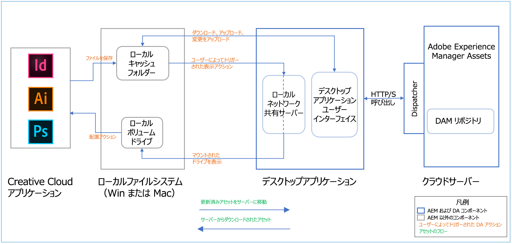

# Adobe Experience Manager デスクトップアプリケーションリリースノート {#release-notes-v2}

| 製品 | Adobe Experience Manager デスクトップアプリケーション |
|--- |--- |
| アプリのバージョン（リビジョン） | 2.0（2.0.3.2） |
| サポートされている AEM バージョン | AEM as a Cloud Service、AEM 6.5、AEM 6.4、AEM 6.3（互換性パッケージを使用） |
| 種類 | マイナーリリース |
| リリース日 | 2020 年 8 月 28 日（Mac および Win） |
| ダウンロード URL | [macOS 64 ビット版](https://download.macromedia.com/aem-assets-companion-app/aem-desktop-osx-2.0.3.2.dmg)、[Windows 64 ビット版](https://download.macromedia.com/aem-assets-companion-app/aem-desktop-win64-2.0.3.2.exe)、[Windows 32 ビット版](https://download.macromedia.com/aem-assets-companion-app/aem-desktop-win32-2.0.3.2.exe) |

## システム要件および使用条件 {#system-requirements-and-prerequisites-v2}

Adobe Experience Manager デスクトップアプリケーションは次のオペレーティングシステムと互換性があります。

* 最新のバグ修正が適用された Mac OS X 10.14 以降。

* 最新のサービスパックとバグ修正が適用された Windows 10。

>[!NOTE]
>
>Windows 7 のベンダーサポートは終了しました（https://support.microsoft.com/ja-jp/help/4057281/windows-7-support-ended-on-january-14-2020）。

Adobe Experience Manager デスクトップアプリケーションは、AEM as a Cloud Service、Adobe Managed Services（AMS）、On-Premise のどちらでデプロイされている場合でも、次の Adobe Experience Manager バージョンと連携します。

* [Adobe Experience Manager as a Cloud Service](https://docs.adobe.com/content/help/ja-JP/experience-manager-cloud-service/release-notes/home.html).

* [Adobe Experience Manager 6.5.0](https://docs.adobe.com/content/help/ja-JP/experience-manager-65/release-notes/release-notes.html) 以降.

* [Adobe Experience Manager 6.4.4](https://docs.adobe.com/content/help/ja-JP/experience-manager-64/release-notes/release-notes.html) 以降.

* Adobe Experience Manager 6.4.0～6.4.3（[互換性パッケージ](https://experience.adobe.com/#/downloads/content/software-distribution/en/aem.html?package=/content/software-distribution/en/details.html/content/dam/aem/public/adobe/packages/cq640/featurepack/adobe-asset-link-support)を使用）。

>[!NOTE]
>
>Adobe Experience Manager 6.3 のデスクトップアプリケーションのサポートは廃止されました。サポートされている新しい Adobe Experience Manager バージョンにアップグレードすることをお勧めします。
>Adobe Experience Manager 6.3.3.1 以降は、[互換性パッケージ](https://www.adobeaemcloud.com/content/marketplace/marketplaceProxy.html?packagePath=/content/companies/public/adobe/packages/cq640/featurepack/adobe-asset-link-support)をインストールした後、デスクトップアプリケーションで動作します。[サービスパックが予定されていないので](https://helpx.adobe.com/jp/experience-manager/maintenance-releases-roadmap.html)、Adobe Experience Manager 6.3 ではそのようなパッケージはありません。

ローカルマシンにインストールする AEM デスクトップアプリケーションのバージョンに応じて、Adobe Experience Manager サーバーの特定のバージョンや、サーバー側の追加コンポーネント（サービスパック、ホットフィックスまたは機能パック）が必要になります。Adobe Experience Manager の管理者に問い合わせてください。

### 様々なアセットおよびファイルタイプのサポート {#support-for-file-types}

デスクトップアプリケーションでは、Adobe Experience Manager に保存されているアセットのうち、アプリケーションの基本操作に対応するバイナリファイルを表すものをサポートします。ネイティブデスクトップアプリケーションでファイルを開くには、PNG や JPG などの特定のファイルタイプと Mac Preview や Adobe Photoshop などの特定のアプリケーションとの関連付けがオペレーティングシステムで設定されている必要があります。

一部のファイルタイプでは、リンクされたアセットをバイナリ内に配置することができます。このようなバイナリファイルをデスクトップアプリケーションで開くときにアセットが Adobe Experience Manager リポジトリに存在する場合は、リンクされたアセットが事前にダウンロードされます。現在サポートされているファイルタイプは次のとおりです。

* [!DNL Adobe InDesign] ファイル（INDD 形式）
* [!DNL Adobe Illustrator] ファイル（AI 形式）
* [!DNL Adobe Photoshop] ファイル（PS 形式）

この機能は、上記アプリケーションの Adobe Creative Cloud 2018 バージョンおよび Adobe Creative Cloud 2019 バージョンでサポートされています。デスクトップアプリケーションは、発見的最良一致アプローチを使用して、リンクされたアセットのローカルデスクトップパスを Adobe Experience Manager サーバー上の URL にマッピングします。このアプローチは、以下を前提としています。

* ネイティブアプリケーションでは、配置されたファイルのパスにグローバルデスクトップパスが使用されます（ローカルネットワーク共有から配置され、「[!UICONTROL Reveal]」オプションで表示されます）。

* パスは、ネイティブアプリケーションによってファイルの XMP レコードに保存されます。

* Adobe Experience Manager では、アセットのメタデータレコードへのパスを使用して XMP レコードの抽出が完了しています。

* パスは Adobe Experience Manager 内のアセットと一致させることができます。つまり、配置されたファイルは Adobe Experience Manager 内でも一致したパスの下に存在しています。

## 新機能および機能強化 {#whats-new-added}

詳しくは、[v2.0 の新機能](introduction.md#whats-new-v2)を参照してください。

**AEM デスクトップアプリケーション v2.0.3 の更新点**

現在のバージョンで修正されたバグは次のとおりです。

* Windows ユーザーがアプリを使用して [!DNL Adobe Experience Manager] 6.5.5.0 インスタンスの DAM リポジトリにアクセスを試みるときに発生するログインの問題を修正しました。

**AEM デスクトップアプリケーション v2.0.2 の更新点**

バグ修正と更新点は次のとおりです。

* アップロードのパフォーマンスを向上させるために、[!UICONTROL Preferences] でアップロードを高速化できます。この設定を有効にすると、AEM デスクトップアプリケーションで使用されるローカル CPU スレッドが増え、リソースがさらに大量に消費されるようになります。

* ファイル名またはパスに特定の GB18030 文字が含まれている場合に発生するアセットアップロードの問題を修正しました。<!-- CQ-4283494 -->

* 検索結果で別の並べ替えタイプに切り替えた後で、「関連性順に並べ替え」オプションを使用できます。<!-- CQ-4286874 -->

* デスクトップアプリケーションで、明示的に更新しなくてもサブフォルダーが一覧表示されるようになりました。<!-- CQ-4285711 -->

* （Windows の場合）一部の Windows コンピューターでデスクトップアプリケーションインターフェイスがまれに使用できない問題を修正しました。インターフェイス要素のクリック領域が横に「シフト」し、アプリケーションインターフェイスがゆがんで表示されるので、クリックできませんでした。<!-- CQ-4280785 -->

**AEM デスクトップアプリケーション v2.0.1 の更新点**

バグ修正と更新点は次のとおりです。

* `%APPDATA%` パスに一致する `%Temp%` ディレクトリを構成するオプションが許可されます。 <!-- CQ-4282665 -->

* ユーザーが Okta SAML 認証を使用して AEM オーサーにログインできるようになります。 <!-- CQ-4278134 -->

## インストール手順 {#installation-instructions-v2}

デスクトップアプリケーションのインストールと設定の方法については、[Adobe Experience Manager デスクトップアプリケーションのインストール](install-upgrade.md)を参照してください。

以前の Adobe Experience Manager デスクトップアプリケーションからアップグレードする場合は、[以前のバージョンからのアップグレード](install-upgrade.md#upgrade-from-previous-version)にリストされている移行のベストプラクティスに従う必要があります。

## デスクトップアプリケーションの動作の仕組みに関する重要なメモ {#how-app-works}

デスクトップアプリケーションとその動作の仕組みについて、以下の点を理解しておくことが重要です。

* デスクトップアプリケーションは、AEM との間でアセットバイナリを完全に転送する必要がある操作（開く、編集、変更のアップロード、アセットのアップロード）を完全にコントロールできます。

   * デスクトップ上でアセットを操作する場合は、個別、フォルダー単位、複数選択のいずれの場合でも、「開く」、「編集」、デスクトップへの「ダウンロード」のいずれかを明示的に実行する必要があります。

   * アセットに対するローカルな変更を AEM にアップロードする場合は、個別のアセットまたは同時に選択した複数のアセットに対して「[!UICONTROL Upload Changes]」を選択する必要があります。

   * デスクトップアプリケーションは、デスクトップと AEM をまたいでアセットを同期させる「同期クライアント」ではありません。

   * デスクトップアプリケーションは、AEM リポジトリを仮想フォルダー構造としてマッピングするネットワーク共有を提供しません。

* デスクトップアプリケーションに表示されるアセットのリストは、AEM Assets リポジトリのステータスに基づいています。ローカルにダウンロードされた後でローカルファイルまたはキャッシュフォルダー内で名前が変更されたファイルは、デスクトップアプリケーションでは表示または管理されません。

* 期待した結果がデスクトップアプリケーションに表示されない場合は、上部のバーにある更新アイコンをクリックしてください。

* 「[!UICONTROL Reveal File]」アクションを使用したときに表示されるローカルネットワーク共有には、ローカルに使用可能なファイル（およびフォルダー）のみ表示されます。「[!UICONTROL Reveal File]」および「[!UICONTROL Reveal Folder]」アクションでは、アセットを事前にダウンロードして、適切なアセットがローカルネットワーク共有に表示されるようにします。

* Adobe Creative Cloud アプリのネイティブファイルにリンクまたは配置されたアセットファイルを Creative Cloud アプリが読み取るときに、SMB（Mac）／WebDAV（Win）ローカルネットワーク共有が使用されます。

ユーザーのアクションによってクラウドとローカルファイルシステムの間で開始されるアセットおよびファイルのフローを次の図に示します。

## 既知の問題 {#known-issues-v2}

**ユーザーインターフェイスに関する問題：**

* デスクトップアプリケーションのインターフェイスが空白になることがあります。右クリックし「[!UICONTROL Refresh]」をクリックして、アプリケーションを再度読み込みます。更新後、DAM リポジトリのルートから開始します。アセットのアップデートまたはステータスは保持されます。 <!-- CQ-4270267 -->

* トラックパッドやマウスホイールを使用せずにフォルダーや検索結果間を移動するのが困難。マウスホイールのないマウスデバイスでは、スクロールバーが表示されないことがあります。<!-- CQ-4269947 -->

* まれに、アセットの変更をアップロードするときに進行状況バーが正しく表示されないことがあります。

* フィルターを適用後に解除してローカルに編集されたすべてのアセットを検索すると、開始時点の検索結果やフォルダー表示に戻りません。DAM リポジトリのルートフォルダーが表示されます。

* AEM サーバーが動作していない URL に接続すると、接続画面が応答しなくなることがあります。アプリケーションを終了して、再度起動してください。

**CRUD（作成、読み取り、更新、削除）操作に関する問題：**

* 無効な文字が含まれていても、アプリケーションがファイルのアップロードを試みるので、サーバー側のアップロードが失敗する可能性があります。<!-- CQ-4273652 -->

* アセットに対する変更をコメント付きでアップロードすると、コメントはアセットと共に AEM に保存されますが、バージョン管理コメントとして表示されません。この問題は AEM 6.4.5 および AEM 6.5.1 で解決済みです。Adobe では、最新のサービスパックをインストールすることを強くお勧めします。 <!-- CQ-4268990 -->

* アセット転送をユーザーがキャンセルできません。意図しない大量の転送をトリガーした場合は、アプリケーションを終了して、再度起動してください。<!-- CQ-4278940 -->

**プラットフォームに関する問題：**

* Windows では、アセットを開くと、編集していなくても、アセットのステータスがすぐに「[!UICONTROL Edited Locally]」に変わる場合があります。「[!UICONTROL Refresh]」をクリックして更新してください。

>[!MORELIKETHIS]
>
>* [AEM as a Cloud Service のドキュメント](https://docs.adobe.com/content/help/ja-JP/experience-manager-cloud-service/landing/home.html)
>* [AEM as a Cloud Service Assets のドキュメント](https://docs.adobe.com/content/help/ja-JP/experience-manager-cloud-service/assets/home.html)
>* [Adobe Experience Manager デスクトップアプリケーションの使用方法](using.md)
>* [デスクトップアプリケーションのインストールとアップグレード](install-upgrade.md)
>* [ベストプラクティスとトラブルシューティングのヒント](troubleshoot.md)

