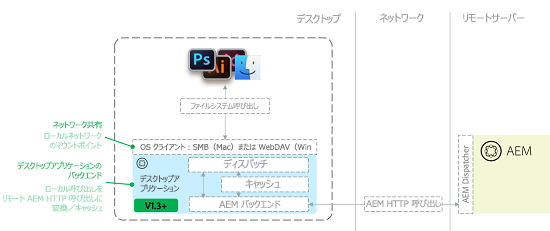

# [!DNL Adobe Experience Manager] デスクトップアプリケーション v1.x のトラブルシューティング {#troubleshoot-aem-desktop-app}

AEM デスクトップアプリケーションのインストール、アップグレード、設定などで発生することのある問題のトラブルシューティングについて説明します。

[!DNL Adobe Experience Manager] デスクトップアプリケーションには、AEM Assets リポジトリーをデスクトップのネットワーク共有（Mac OS では SMB 共有）としてマッピングするのに役立つユーティリティが含まれています。ネットワーク共有とは、リモートソースをコンピューターのローカルファイルシステムの一部であるかのように扱うオペレーティングシステム（OS）テクノロジーです。デスクトップアプリケーションの場合は、リモート AEM インスタンスのデジタルアセット管理（DAM）リポジトリー構造をリモートファイルソースとして利用します。デスクトップアプリケーションのトポロジを次の図に示します。



このアーキテクチャでは、デスクトップアプリケーションはマウントされたネットワーク共有に対するファイルシステムコール（open、close、read、write など）を受け取り、それらを AEM サーバーへのネイティブな AEM HTTP 呼び出しに変換します。ファイルはローカルにキャッシュされます。詳しくは、[AEM デスクトップアプリケーション v1.x の使用](use-app-v1.md)を参照してください。

## AEM デスクトップアプリケーションコンポーネントの概要 {#desktop-app-component-overview}

デスクトップアプリケーションには、以下のコンポーネントが含まれています。

* **デスクトップアプリケーション**：DAM をリモートファイルシステムとしてマウント／アンマウントし、ローカルにマウントされたネットワーク共有と、接続先のリモート AEM インスタンスとの間のファイルシステムコールを変換します。
* **オペレーティングシステムの WebDAV／SMB クライアント**：Windows エクスプローラー／Finder とデスクトップアプリケーションとのやり取りを処理します。ファイルの取得、作成、変更、削除、移動またはコピーがおこなわれた場合は、オペレーティングシステム（OS）の WebDAV／SMB クライアントがこの操作をデスクトップアプリケーションに伝えます。操作を受け取ると、デスクトップアプリケーションはそれをネイティブな AEM リモート API 呼び出しに変換します。例えば、ユーザーがマウントされたディレクトリ内でファイルを作成する場合は、WebDAV／SMB クライアントがリクエストを開始します。デスクトップアプリケーションはこのリクエストを、DAM 内でファイルを作成するための HTTP リクエストに変換します。WebDAV／SMB クライアントは OS に組み込まれたコンポーネントであり、デスクトップアプリケーション、AEM またはアドビとはいかなる関係もありません。
* **Adobe Experience Manager インスタンス**：AEM Assets DAM リポジトリーに保存されたアセットへのアクセスを提供します。さらに、ローカルのデスクトップアプリケーションに代わってデスクトップアプリケーションからリクエストされたアクションを実行し、マウントされたネットワーク共有とのやり取りをおこないます。ターゲットの AEM インスタンスは AEM バージョン 6.1 以上を実行していることが必要です。以前のバージョンの AEM を実行している AEM インスタンスでは、すべての機能を利用するために追加の機能パックおよびホットフィックスのインストールが必要になることがあります。

## AEM デスクトップアプリケーションの想定される使用例 {#intended-use-cases-for-aem-desktop-app}

AEM デスクトップアプリケーションはネットワーク共有テクノロジーを使用して、リモート AEM リポジトリーをローカルデスクトップにマッピングします。しかしこれは、アセットを保持するネットワーク共有の代わりではありません。ユーザーはローカルデスクトップから直接、デジタルアセットの管理操作をおこないます。これには例えば、直接 Finder／エクスプローラー内で複数のファイルを移動またはコピーしたり、大規模なフォルダー構造を AEM Assets ネットワーク共有にドラッグすることが含まれます。

AEM デスクトップアプリケーションは、AEM Assets のタッチ操作対応 UI とローカルデスクトップの間をつなぎ、DAM アセットのアクセス（オープン）と編集（保存）を手軽におこなえるようにする手段となります。これにより、AEM Assets サーバー内のアセットとデスクトップベースのワークフローがリンクされます。

以下に、AEM デスクトップアプリケーションのサンプルの使用例を示します。

* ユーザーが AEM にログインし、Web UI を使用してアセットを検索します。
* ユーザーは AEM Web UI のデスクトップアクション機能を使用して、必要に応じてデスクトップ上でアセットのオープン、表示、編集をおこないます。
* AEM デスクトップアプリケーションはそのアセットをアセットのファイルタイプに応じたデフォルトのエディターで開きます。
* ユーザーが必要に応じてアセットを変更します。
* ファイルを変更した後、ユーザーは AEM デスクトップアプリケーションのバックグラウンド同期ステータスウィンドウを使用して、ファイルの同期ステータスを表示できます。
* ユーザーは、AEM デスクトップアプリケーションのコンテキストメニューを使用して、アセットをチェックイン／チェックアウトするか、DAM ユーザーインターフェイスに戻ります。
* ファイルに対する変更が完了したら、ユーザーは AEM Web UI に戻ります。

これが唯一の使用例ではありませんが、この例から、AEM デスクトップアプリケーションがアセットのアクセスと編集をローカルで実行する便利な手段であることがわかります。可能な限り、DAM Web UI を使用することをお勧めします。こちらの方が操作性に優れており、アドビにとっても、ユーザーの要件に柔軟に対応できるというメリットがあります。

## 制限事項 {#limitations}

WebDAV／SMB1 ネットワーク共有は、ファイルをエクスプローラー／Finder ウィンドウ内で操作するための便利な方法です。ただし、ネットワーク接続を介してエクスプローラー／Finder と AEM の間でやり取りする際には、一定の制限があります。例えば、1 GB のファイルをマウントされた WebDAV／SMB ディレクトリにコピーするのにかかる時間は、1 GB のファイルを Web ブラウザーを使用して Web サイトにアップロードするのに必要な時間とほぼ同じです。実際のところ、前者の処理については、WebDAV／SMB プロトコルや OS の WebDAV／SMB クライアントの非効率性のために、もっと時間がかかることがあります（特に Mac OS X の場合）。

マウントされたディレクトリで実行できる作業の種類には制限があります。一般的に、大きなファイルの取り扱いは困難です。特に、低速／高レイテンシ／低帯域幅のネットワーク接続を使用する場合や、大きなファイルを編集する場合には支障があります。

マウントされたディレクトリからその場で特定のファイルタイプを効率的に編集できると顧客に約束する前に、そのシナリオに沿ったテストを実施することをお勧めします。

AEM デスクトップアプリケーションは、以下のような大量の I/O を伴うファイルシステムの操作（これらに限りません）には適していません。

* ファイルやディレクトリの移動またはコピー
* AEM への多数のアセットの追加
* ファイルシステム全体を対象としたファイルの検索とオープン（フォルダーの参照を除く）
* ファイルアーカイブの圧縮と解凍

オペレーティングシステムの制限により、Windows ではファイルサイズの上限が 4,294,967,295 バイト（約 4.29 GB）と定められています。この制限は、ネットワーク共有上のファイルサイズの上限を定めるレジストリ設定に由来します。このレジストリ設定は DWORD 値であり、DWORD 値の上限が前述の数値になっています。

[!DNL Experience Manager] デスクトップアプリケーションには、一定時間の経過後に [!DNL Experience Manager] サーバーとデスクトップアプリケーションの間の接続を切断するための設定可能なタイムアウト値がありません。サイズの大きいアセットをアップロードする際に、しばらくして接続がタイムアウトした場合、アプリケーションはアップロードタイムアウトを長くして、アセットのアップロードを数回再試行します。デフォルトのタイムアウト設定を変更するお勧めの方法はありません。

## キャッシュと AEM との通信 {#caching-and-communication-with-aem}

AEM デスクトップアプリケーションは、使い勝手を向上させるために、内部キャッシュとバックグラウンドアップロード機能を備えています。大きなファイルを保存するときは、作業を続けられるように、まずローカルに保存されます。一定時間（現在は 30 秒）が経過すると、そのファイルが AEM サーバーにバックグラウンドで送信されます。

Creative Cloud デスクトップアプリケーションやその他のファイル同期ソリューション（Microsoft One Drive など）とは異なり、AEM デスクトップアプリケーションは完全なデスクトップ同期クライアントではありません。なぜなら、AEM デスクトップアプリケーションは AEM Assets リポジトリー全体へのアクセスを提供しますが、このリポジトリーはときに数百 GB から数 TB に及び、完全に同期するには大きすぎる場合があるからです。

キャッシュは、ネットワークやストレージのオーバーヘッドを制限し、ユーザーに関連のあるアセットのサブセットのみを扱うための機能です。

>[!CAUTION]
>
>ブラウズを高速化するために、サムネールの生成をオフにすることをお勧めします。アイコンプレビューを有効にした場合、マウントされたフォルダー内を移動すると、アプリケーションはデジタルアセットをキャッシュします。また、ユーザーにとって重要でない可能性のあるアセットもダウンロードされるので、サーバーに負荷がかかり、ユーザーの帯域幅が消費され、使用されるユーザーのディスク領域も増えます。

AEM デスクトップアプリケーションにおけるキャッシュの仕組みは以下のとおりです。

* ユーザーが Finder 内でフォルダーを開いてファイルのサムネール／プレビューを表示したり、アプリケーション内でファイルを開いたりすると、デスクトップアプリケーションはそのファイルバイナリをキャッシュします。
* ユーザーが Finder またはその他のデスクトップアプリケーションを通じてファイルを保存すると、そのファイルはまずローカルに保存され（キャッシュされ）、オペレーティングシステムに通知が送られます。その後、ファイルはバックグラウンドでサーバーにアップロードするためのキューに登録され、最終的にネットワークを通してアップロードされます。ネットワークエラーが発生した場合、デスクトップアプリケーションはファイル全体のアップロードを最大 3 回再試行します。3 回再試行してもアップロードできない場合、ファイルは競合ファイルとしてマークされ、バックグラウンドアップロードキューのステータスウィンドウにステータスが表示されます。デスクトップアプリケーションは、その後はファイルの更新を試みません。ユーザーは、接続が回復した後にファイルを更新して再度アップロードする必要があります。

すべての操作がローカルにキャッシュされるわけではありません。以下の操作は、ローカルにキャッシュされず、すぐに AEM サーバーに送信されます。

* フォルダーに対するあらゆる操作（作成、削除など）。
* バージョン 1.4 で導入されたフォルダーアップロード機能を使用すると、ファイルをローカルにキャッシュすることなく、ローカルフォルダー階層をアップロードできます

## 個別の操作 {#individual-operations}

個別のユーザーについてパフォーマンス関連のトラブルシューティングをおこなう際は、まず[制限事項](https://helpx.adobe.com/jp/experience-manager/desktop-app/troubleshooting-desktop-app.html#limitations)を確認してください。以降の節では、個別のユーザーのパフォーマンスを向上させるための推奨事項について説明します。

## 帯域幅の推奨事項 {#bandwidth-recommendations}

個別のユーザーが利用できる帯域幅は、WebDAV／SMB クライアントのパフォーマンスにとって重要な役割を果たします。

個別のユーザーのアップロード速度を 10 Mbps 近くにすることをお勧めします。無線接続では、帯域幅が複数のユーザーで共有されることがよくあります。ネットワークの帯域幅を消費するタスクを複数のユーザーが同時に実行すると、パフォーマンスがさらに低下する可能性があります。このような問題を避けるために、有線接続を使用してください。

## Windows 固有の設定 {#windows-specific-configurations}

Windows で AEM を実行する場合は、WebDAV クライアントのパフォーマンスを向上させるように Windows の設定をすることができます。詳しくは、[https://support.microsoft.com/ja-jp/kb/2445570](https://support.microsoft.com/ja-jp/kb/2445570) を参照してください。

Windows 7 では、IE 設定を変更すると、WebDAV のパフォーマンスを向上させることができます。詳しくは、[Windows 7 で WebDAV のパフォーマンス低下を修正する方法](https://oddballupdate.com/2009/12/fix-slow-webdav-performance-in-windows-7/)を参照してください。

## 同時操作 {#concurrent-operations}

ユーザーがローカルでファイルを操作するときには、AEM デスクトップアプリケーションは、そのファイルの新しいバージョンが AEM 内にないかを確認します。新しいバージョンがある場合は、ファイルの新しいコピーをローカルキャッシュにダウンロードします。ただし、ローカルにキャッシュされているファイルが変更済みである場合は、そのファイルを上書きしません。この機能により、ユーザーの作業内容が誤って上書きされることを防止できます。

同じファイルがローカルと AEM の両方で変更されている場合は、ローカルで変更された方のバージョンが AEM のバージョンを上書きします。この場合、以前のバージョンはアセットのタイムラインで利用できるので、ユーザーが両方のバージョンを確認して、競合を解決することができます。

ローカルファイルとサーバーのバージョンで不整合がある場合は、バックグラウンドアップロードのステータスダイアログに、競合についての通知が表示されます。この問題を解決するには、競合しているファイルを開いて保存します。ファイルを保存することで、AEM デスクトップアプリケーションに最新のローカルの変更内容を AEM に同期させることができます。ユーザーは以前のバージョンのアセットをタイムラインで参照して、競合を解決できます。

複数のユーザーが別々のマウントされたディレクトリで同じ AEM インスタンスをターゲットにして作業する場合には、さらに考慮すべき点があります。特に、以下の点が重要になります。

* ユーザーの発信側ネットワークで利用できる帯域幅の量
* ファイアウォールやプロキシなどの、発信側ネットワークのネットワーク設定
* ターゲット AEM インスタンスのネットワークで利用できる帯域幅の量
* ターゲット AEM インスタンスの前に Dispatcher が存在するかどうか
* ターゲット AEM インスタンスの現在の負荷

## 追加の AEM 設定 {#additional-aem-configurations}

複数のユーザーが同時に作業すると WebDAV／SMB のパフォーマンスが大幅に低下する場合は、AEM でいくつかの設定をおこなって、パフォーマンスの向上を図ることができます。

## アセットの更新の一時的なワークフロー {#update-asset-transient-workflows}

DAM アセットの更新ワークフローで一時的なワークフローを有効にすることで、AEM 側のパフォーマンスを向上できます。一時的なワークフローを有効にすることで、AEM でアセットを作成または変更する際に、アセットの更新に必要な処理能力を低く抑えることができます。

1. 設定する AEM インスタンスの `/miscadmin` に移動します（例：`http://[Server]:[Port]/miscadmin`）。
1. ナビゲーションツリーで、**ツール**／**ワークフロー**／**モデル**／**dam** と展開します。
1. 「**DAM アセットの更新**」をダブルクリックします。
1. フローティングツールパネルで、「**ページ**」タブに切り替えて「**ページプロパティ**」をクリックします。
1. 「**一時的なワークフロー**」チェックボックスをオンにして、「**OK**」をクリックします。

### Granite 一時ワークフローキューの調整 {#adjust-granite-transient-workflow-queue}

AEM のパフォーマンスを向上させるもう 1 つの方法は、「Granite 一時的なワークフローキュー」ジョブについて並列ジョブの最大数を設定することです。推奨される値は、サーバーで利用可能な CPU の数の半分程度です。値を調整するには、以下の手順に従います。

1. 設定する AEM インスタンスの */system/console/configMgr* に移動します（例：`http://[aem_server]:[port]/system/console/configMgr`）。
1. **QueueConfiguration** を検索し、各ジョブをクリックして開き、「**Granite 一時的なワークフローキュー**」ジョブを探します。横にある「編集」をクリックします。
1. 「**並列ジョブの最大数**」の値を変更して、「**保存**」をクリックします。

## AWS 設定 {#aws-configuration}

複数のユーザーが同時に作業をおこなうと、ネットワーク帯域幅の制限により、WebDAV／SMB のパフォーマンスが低下することがあります。WebDAV／SMB のパフォーマンスを向上させるために、AWS 上で実行されるターゲット AEM インスタンス用の AWS インスタンスのサイズを大きくすることをお勧めします。

具体的には、サーバーで利用できるネットワーク帯域幅の量を増やします。以下に詳細を示します。

* AWS インスタンスのサイズを大きくすると、インスタンスに割り当てられたネットワーク帯域幅の量が増えます。それぞれのインスタンスサイズで利用できる帯域幅について詳しくは、[AWS のドキュメント](https://aws.amazon.com/ec2/instance-types/)を参照してください。
* アドビが大口顧客のためにトラブルシューティングをおこなう際には、AEM インスタンスのサイズを c4.8xlarge に設定します。これは主に、そのインスタンスが提供する専用の帯域幅を 4,000 Mbps にするためです。
* AEM インスタンスの前に Dispatcher がある場合は、Dispatcher のサイズが適切であることを確認します。AEM インスタンスの帯域幅が 4,000 Mbps であっても、Dispatcher が 500 Mbps しかなければ、実効帯域幅は 500 Mbps になります。これは、Dispatcher がネットワークのボトルネックとなるからです。

## チェックアウトしたファイルの制限 {#checked-out-file-limitations}

チェックアウトしたファイルをエクスプローラー／Finder から操作する方法については、いくつか既知の制限があります。チェックアウトされたファイルは、そのファイルをチェックアウトしたユーザー以外のユーザーに対しては読み取り専用となっていることが必要です。AEM の WebDAV／SMB1 プロトコルの実装では、このルールが適用されます。しかし、OS の WebDAV／SMB クライアントは、チェックアウトされたファイルに対して適切な処理をおこなわないことがあります。以下に、不適切な動作のいくつかを示します。

### 一般 {#general}

チェックアウトしたファイルに書き込むときには、AEM の WebDAV 実装の範囲内においてのみロックが適用されます。その結果、WebDAV を使用するクライアント（デスクトップアプリケーションなど）でのみロックが適用されることになります。AEM の Web インターフェイスを介した場合は、ロックが適用されません。AEM インターフェイスは、チェックアウトされたアセットのカード表示にロックアイコンを表示するのみです。このアイコンはただの飾りであり、AEM の動作には影響しません。

通常、WebDAV クライアントは、常に予期したとおりに動作するとは限りません。他に問題が発生することがあります。ただし、AEM 内でアセットを更新またはチェックインすれば、アセットが変更されていないことを確実に確認できます。これはアドビの管理下にない OS の WebDAV クライアントで一般的な動作です。

### Windows {#windows}

ファイルを削除すると、そのファイルが Windows のエクスプローラーに表示されなくなるので、処理が成功したように見えます。しかし、ディレクトリを更新して AEM アセットをチェックインすると、ファイルがまだ存在していると表示されます。また、ファイルの編集も成功したように見えます（警告ダイアログやエラーメッセージは表示されません）。しかし、ファイルを再度開いたり、AEM アセットをチェックインすると、ファイルが変更されていないことがわかります。

#### Mac OS X {#mac-os-x}

ファイルを置換しても警告やエラーは表示されませんが、AEM にアセットをチェックインすると、変更されていない状態のままになっています。AEM 内でアセットを更新またはチェックインすると、アセットが変更されていないことを確認できます。

## デスクトップアプリケーションのアイコンに関する問題のトラブルシューティング（Mac OS X） {#troubleshooting-desktop-app-icon-issues-mac-os-x}

デスクトップアプリケーションをインストールすると、デスクトップアプリケーションのメニューアイコンがメニューバーに表示されます。アイコンが表示されない場合は、問題解決のために以下の手順を実行してください。

1. オペレーティングシステムのターミナルウィンドウを開きます。
1. コマンドプロンプトで以下のコマンドを入力して、Enter キーを押します。

   ```shell
    cd ../Library/Caches.
   ```

1. 以下のコマンドを入力して、Enter キーを押します。

   ```shell
   rm -r com.adobe.aem.assetscompanion
   ```

1. 以下のコマンドを入力して、Enter キーを押します。

   ```shell
   cd ~/Library/Preferences
   ```

1. 以下のコマンドを入力して、Enter キーを押します。

   ```shell
   rm com.adobe.aem.assetscompanion.plist
   ```

1. 以下のコマンドを入力して、Enter キーを押します。

   ```shell
   rm ~/Library/Group\ Containers/group.com.adobe.aem.desktop/*
   ```

1. システムを再起動します。

AEM デスクトップアプリケーションは、特定のファイルに対して 3 回同期を試みます。3 回試行してもファイルの同期に失敗する場合、AEM デスクトップアプリケーションはファイルが競合していると見なし、バックグラウンドアップロードのステータスウィンドウに通知が表示されます。競合状態とは、最新の変更内容がローカルに存在しているが、まだ AEM に同期されていないことを示します。それ以降、AEM デスクトップアプリケーションは同期を試みません。

この状況を解決する最も簡単な方法は、競合しているファイルを開き、再度保存することです。保存することで、AEM デスクトップアプリケーションはさらに 3 回同期を試みます。それでもファイルの同期に失敗する場合は、以下の節を参照してください。

## AEM デスクトップアプリケーションのキャッシュのクリア {#clearing-aem-desktop-cache}

AEM デスクトップアプリケーションのキャッシュのクリアは、最初におこなうべきトラブルシューティング作業です。これにより、AEM デスクトップアプリケーションで発生するいくつかの問題を解決できます。

次の場所にあるアプリケーションのキャッシュディレクトリを削除して、キャッシュをクリアできます。
Windows の場合、`%LocalAppData%\Adobe\AssetsCompanion\Cache\`

Mac の場合、`~/Library/Group/Containers/group.com.adobe.aem.desktop/cache/`

ただし、AEM デスクトップアプリケーションの AEM エンドポイントの設定によっては、場所が異なる場合があります。値は、ターゲット URL のエンコードされたバージョンです。例えば、アプリケーションのターゲットが `http://localhost:4502` の場合、ディレクトリ名は `http%3A%2F%2Flocalhost%3A4502%2F` となります。

キャッシュをクリアするには、&lt;エンコードされた AEM エンドポイント> ディレクトリを削除します。

>[!NOTE]
>
>AEM デスクトップアプリケーションのキャッシュをクリアすると、AEM に同期されていないローカルファイルの変更内容は失われます。

>[!NOTE]
>
>AEM デスクトップアプリケーション 1.5 以降では、キャッシュをクリアするオプションがデスクトップアプリケーションの UI に用意されています。

## AEM デスクトップアプリケーションのバージョンの確認 {#finding-the-aem-desktop-version}

AEM デスクトップアプリケーションのバージョンの確認手順は、Windows と Mac OS の両方で同じです。

AEM デスクトップアプリケーションのアイコンをクリックして、「**バージョン情報**」を選択します。画面にバージョン番号が表示されます。

## macOS での AEM デスクトップアプリケーションのアップグレード {#upgrading-aem-desktop-app-on-macos}

macOS で AEM デスクトップアプリケーションをアップグレードするときに問題が発生することがあります。これは、AEM デスクトップアプリケーションの古いシステムフォルダーによって、AEM デスクトップアプリケーションの新しいバージョンが正しく読み込まれなくなるからです。この問題を修正するには、以下のフォルダーおよびファイルを手動で削除します。

以下の手順を実行する前に、「Adobe Experience Manager デスクトップアプリケーション」アプリケーションを macOS のアプリケーションフォルダーからゴミ箱にドラッグします。次に、ターミナルを開き、以下のコマンドを実行します。パスワードを求められたら入力します。

```shell
sudo rm -rf ~/Library/Application\ Support/com.adobe.aem.desktop
sudo rm -rf ~/Library/Preferences/com.adobe.aem.desktop.plist
sudo rm -rf ~/Library/Logs/Adobe\ Experience\ Manager\ Desktop

sudo find /var/folders -type d -name "com.adobe.aem.desktop" | xargs rm -rf
sudo find /var/folders -type d -name "com.adobe.aem.desktop.finderintegration-plugin" | xargs rm -rf
```

## 他のユーザーによってチェックアウトされているファイルの保存 {#saving-a-file-checked-out-by-others}

オペレーティングシステムの技術的な制限により、他のユーザーによってチェックアウトされているファイルを上書きしようとしたときに、一貫した動作が保証されていません。チェックアウトされたファイルをどのアプリケーションで編集するかによって、動作が異なります。アプリケーションによっては、ディスク書き込みエラーを示すエラーメッセージが表示されたり、無関係に見えるエラーや一般的なエラーが表示されることがあります。また、エラーメッセージが表示されず、操作が成功したように見えることもあります。

上記のような場合でも、ファイルを閉じてから再度開くと、コンテンツが変化していないことがあります。ただし、一部のアプリケーションでは、ファイルのバックアップが保存されるので、変更内容を後から適用することができます。

この動作にもかかわらず、チェックインしたときには、ファイルが変更されていません。異なるバージョンのファイルが表示されている場合でも、変更内容は AEM に同期されません。

## ファイルの移動に関する問題のトラブルシューティング {#troubleshooting-problems-around-moving-files}

移動およびコピー操作を機能させるには、サーバー API に追加のヘッダー X-Destination、X-Depth および X-Overwrite を渡す必要があります。Dispatcher はこれらのヘッダーをデフォルトで渡さないので、それが原因で操作が失敗します。詳しくは、[Dispatcher の背後にある AEM インスタンスへの接続](install-configure-app-v1.md#connect-to-an-aem-instance-behind-a-dispatcher)を参照してください。

## AEM デスクトップアプリケーションの接続の問題のトラブルシューティング {#troubleshooting-aem-desktop-connection-issues}

### SAML のリダイレクトの問題 {#saml-redirect-issue}

AEM デスクトップアプリケーションを SSO 対応（SAML）AEM インスタンスに接続する際に発生する問題の最も一般的な原因は、SAML プロセスが最初にリクエストされたパスに戻ってこないことです。あるいは、AEM デスクトップアプリケーションで設定されていないホストに接続がリダイレクトされることがあります。ログインプロセスを確認するために、以下の手順を実行してください。

1. Web ブラウザーを開きます。
1. アドレスバーに `/content/dam.json` という URL を入力します。
1. URL をターゲット AEM インスタンスに置き換えます（例：`http://localhost:4502/content/dam.json`）。
1. AEM にログインします。
1. ログイン後、アドレスバーに表示されているブラウザーの現在のアドレスを確認します。このアドレスが、最初に入力した URL と一致している必要があります。
1. `/content/dam.json` の前の部分がすべて、AEM デスクトップアプリケーションで設定したターゲット AEM インスタンスの値と一致していることを確認します。

### SSL 設定の問題 {#ssl-configuration-issue}

AEM デスクトップアプリケーションが HTTP 通信に使用するライブラリは SSL を厳格に適用します。ブラウザーでは成功する接続が、AEM デスクトップアプリケーションでは失敗することがあります。SSL を適切に設定するには、不足している中間証明書を Apache にインストールします。[中間 CA の証明書を Apache にインストールするには](https://access.redhat.com/solutions/43575)を参照してください。

## AEM デスクトップアプリケーションを Dispatcher と併用する {#using-aem-desktop-with-dispatcher}

AEM デスクトップアプリケーションは、AEM を Dispatcher の背後にデプロイする構成で動作します。これは、AEM サーバーの推奨されるデフォルトの構成です。AEM オーサリング環境の前にある AEM Dispatcher は、通常、DAM アセットのキャッシュをスキップするように設定されます。したがって、AEM デスクトップアプリケーションから見ると、Dispatcher は追加のキャッシュ機能を提供しません。Dispatcher の設定が AEM デスクトップアプリケーションに適したものとなっていることを確認してください。詳しくは、[Dispatcher の背後にある AEM インスタンスへの接続](install-configure-app-v1.md#connect-to-an-aem-instance-behind-a-dispatcher)を参照してください。

## ログファイルの確認 {#checking-for-log-files}

AEM デスクトップアプリケーションのログファイルの場所は、オペレーティングシステムによって異なります。それぞれ以下の場所にあります。

* Windows：`%LocalAppData%\Adobe\AssetsCompanion\Logs`
* Mac：`~/Library/Logs/Adobe\ Experience\ Manager\ Desktop`
