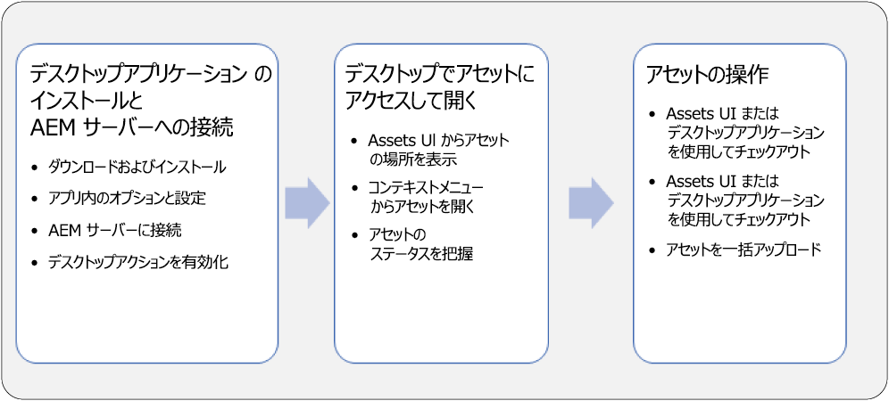
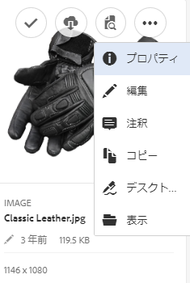
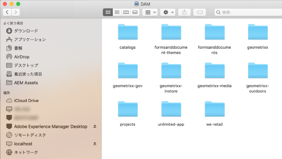
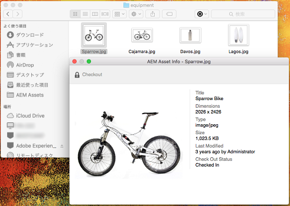
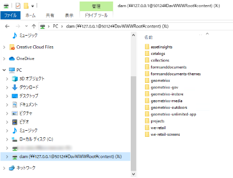
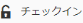

# AEM Desktop App v1.x の使用 {#use-aem-desktop-app-v1x}

AEM Desktop App を使用すると、AEM 内のアセットにローカルデスクトップから手軽にアクセスし、任意のデスクトップアプリケーションで利用できるようになります。アセットを Mac Finder や Windows エクスプローラーで容易に表示し、デスクトップアプリケーションで開いて、ローカルで変更できます。変更内容は AEM に保存され、リポジトリ内に新しいバージョンが作成されます。

このような統合により、組織内の様々な役割のユーザーが AEM Assets でアセットを一元管理し、Creative Cloud やその他のアプリケーションからアセットにアクセスできるようになります。さらに、ブランディングなど様々な基準に準拠することが容易になります。

AEM Desktop App v1 を使用しておこなう主なタスクは次のとおりです。

* [AEM サーバーと接続する](#installandconnect)

* [アセットをデスクトップで直接開く](#openondesktop)
* [アセットをデスクトップから編集およびチェックアウトする](#workonassets)

* [アセットおよびフォルダーを一括アップロードする](#bulkupload)

様々な推奨事項や注意事項については、[AEM Desktop App を使用する際のベストプラクティス](best-practices-for-v1.md)を参照してください。AEM Desktop App を使用する際に問題が発生した場合は、[AEM Desktop App のトラブルシューティング](troubleshoot-app-v1.md)を参照してください。

>[!NOTE]
>AEM Desktop App は AEM 6.1 リリースで導入され、当初は AEM Assets Companion App と呼ばれていました。

## クリエイティブワークフローでの AEM Desktop App のタッチポイント {#aem-desktop-app-touch-points-in-the-creative-workflow}

AEM Desktopアプリケーションは、AEM Assetsと共にクリエイティブワークフローに統合され、次のタッチポイントを提供します。

クリエイティブワークフローでの AEM Desktop App のタッチポイント

## AEM Desktop App のインストールと AEM サーバーへの接続 {#installandconnect}

クリエイティブアセットの作成または編集を開始する前に、リポジトリのアセットをダウンロードおよびアップロードするために AEM Desktop App を AEM Assets サーバーに接続します。以下の作業をおこないます。

1. [アプリをインストールします](#installapp)。
1. [環境設定](#inapppref)および接続の詳細を設定します。
1. [AEM サーバーに接続](#connect)し、アセットリポジトリをローカルドライブとしてマウントします。
1. AEM サーバーで[「デスクトップアクション」を有効にします。](#desktopactions)

AEM Desktop App は、安全かつ堅牢にアセットを転送するために、AEM サーバーへの接続に HTTPS 接続を使用します。

>[!NOTE]
>インストールおよび設定手順の一部または全体で、AEM 管理者またはシステム管理者のサポートが必要になることがあります。

### アプリケーションのインストール {#installapp}

AEM Desktop App を使用するには、AEM サーバーのバージョンが AEM Desktop App でサポートされていることを確認します。使用するオペレーティングシステム（Mac または Windows）に適したインストールファイル（バイナリ）をダウンロードして、アプリケーションをインストールします。

ネットワークおよびシステムの環境設定によっては、詳細な設定が必要になることがあります。詳しくは、[AEM Desktop App のインストールと設定](install-configure-app-v1.md)を参照してください。

1. [AEM Desktop App のダウンロードページ](https://helpx.adobe.com/experience-manager/kb/download-companion-app.html)に移動し、オペレーティングシステムに適したバイナリをダウンロードします。
1. ダウンロードしたインストールファイルを実行し、画面上の指示に従ってアプリケーションをインストールします。

   >[!NOTE]
   >インストールして一度にアクティブ化できる AEM Desktop App のインスタンスは 1 つだけです。

### アプリケーション内のオプションと環境設定について {#inapppref}

アプリケーションでは、AEM サーバーとの接続および切断、アップロードのステータスの表示、ローカルキャッシュの管理などの設定をおこなうことができます。通常は、デフォルト設定で使用することができます。必要に応じて、アプリケーションや AEM サーバーとの統合について詳細な設定をおこなうことができます。以下では、様々な設定について詳しく説明します。

**Explore Assets**：AEM Assets リポジトリをマウントしたローカルドライブを開きます。つまり、ローカルマシンで利用できるようになったアセットを参照します。

**View Asset Status**：変更したアセットを AEM Assets リポジトリにアップロードしたり、新しいアセットを追加したりするときは、アセットがバックグラウンドでアップロードされます。バックグラウンドで処理されるので、サイズの大きいアセットでもアップロード完了まで待つ必要がなくなり、円滑な作業が可能になります。ユーザーは変更内容をローカルで保存するだけで、他に何かする必要はありません。これらのアセットをアプリケーションからサーバーに送信するには、ある程度の時間がかかります（利用可能な帯域幅によります）。アップロードのステータスや、その他いくつかの基本情報を確認できます。

**Options**：AEM Desktop App トレイから「Options」をクリックまたはタップすると、システム起動時にアプリケーションを起動したり、アプリケーション起動時に AEM サーバーに接続したり、マウント後に AEM Assets を利用できるローカルドライブ文字を変更したりする設定にアクセスできます。

**Advanced／Manage Cache**：ローカルキャッシュに使用するディスク容量を管理できます。AEM Assets サーバーのアーティファクトはローカルにキャッシュされ、スムーズに利用することができます。要件に応じてデフォルト設定を変更することができます。キャッシュをクリアして、すべてのアセットを取得し直すこともできます。キャッシュをクリアした場合でも、未保存の変更内容は維持されます。AEM サーバーにチェックインしていないアセットは、削除されずにそのまま保持されます。

### AEM サーバーへの接続 {#connect}

アプリは、Windows および Mac のプロキシ設定をサポートします。設定はアプリの起動時に読み込まれます。プロキシ設定を変更した場合は、変更を適用するためにアプリを再起動します。

>[!NOTE]
>
>プロキシ設定を変更した場合は、変更を適用するためにアプリを再起動します。それ以外の場合、アプリは設定済みのプロキシサーバーを引き続き使用します。

1. AEM Desktop App を起動します。アプリケーションに AEM インスタンスをマッピングするには、AEM サーバーを `https://[aem-server-url]:[port]` の形式で指定します。

   

1. ログイン画面で、インスタンスのユーザー名とパスワードを指定します。別の AEM インスタンスを指定するには、「**[!UICONTROL Alternate Login URL]**」オプションを選択します。

   

### AEM Web インターフェイスでのデスクトップアクションの有効化 {#desktopactions}

ブラウザーの Assets UI から、アセットの場所を参照したり、アセットをチェックアウトしてデスクトップアプリケーションで編集用に開くことができます。これらのオプションはデスクトップアクションと呼ばれており、デフォルトでは有効になっていません。デスクトップアクションを有効にするには、以下の手順に従います。

1. アセットコンソールで、ツールバーの&#x200B;**ユーザー**&#x200B;アイコンをクリックまたはタップします。
1. 「**[!UICONTROL My Preferences]**」をクリックまたはタップして、**[!UICONTROL Preferences]**&#x200B;ダイアログを表示します。
1. ユーザーの環境設定ダイアログで、「**[!UICONTROL Show Desktop Actions For Assets]**」を選択します。「**[!UICONTROL Accept]**」をクリックまたはタップします。

   

   「アセットのデスクトップアクションを表示」をチェックしてデスクトップアクションを有効化

## デスクトップでのアセットへのアクセスとオープン {#openondesktop}

>[!NOTE]
>Windows の場合、[Windows 7 のデフォルト設定](https://support.microsoft.com/en-us/kb/2668751)では、50 MB より大きなアセットを AEM Desktop App で処理できません。

### AEM Web インターフェイスからマッピングされたアセットの場所の表示 {#reveal-the-location-of-mapped-assets-from-aem-web-interface}

AEM Assets リポジトリをローカルドライブにマッピングした後で、マッピングされたアセットとフォルダーに対して追加のアイコンと「フォルダーのアップロード」機能が表示されるように設定できます。

1. AEM Assets インターフェイスを開き、フォルダーまたはアセットの上にマウスポインターを置くと、デスクトップアクションがカード表示のクイックアクションとして表示されます。

   

   Assets UI でクイックアクションメニューを開き、デスクトップアクションを表示

   これらのデスクトップアクションは、アセットを選択した後のツールバー、またはアセットページにあるツールバーの「**デスクトップアクション**」アイコンをクリックまたはタップしても使用できます。

1. 特定のファイル拡張子に関連付けられているデスクトップアプリケーションでアセットを表示するには、「**デスクトップで開く**」クイックアクション  をクリックまたはタップします。

   または、ツールバーの&#x200B;**デスクトップアクション**&#x200B;メニューから「**開く**」を選択します。

1. 「**表示**」クイックアクション  をクリックまたはタップすると、ローカルファイルシステム内の特定のアセットを探すことができます。

   または、ツールバーの&#x200B;**デスクトップアクション**&#x200B;メニューから「**表示**」を選択します。

### Finder またはエクスプローラーから AEM アセットを開く {#open-aem-assets-from-the-finder-or-the-explorer}

Mac の場合は、コンテキストメニューで「Open」を選択し、AEM Desktop App を通してアセットを開きます。

Adobe InDesign（INDD）ファイルでは、コンテキストメニューで「**[!UICONTROL Open]**」を選択します。このオプションをクリックすると、リンクされているアセットが AEM Desktop App によってローカルファイルシステムにダウンロードされ、Adobe InDesign で INDD ファイルが表示されます。この方法を使用することで、INDD ファイルを編集するときに必要なアセットをローカルで利用できます。

Windows の場合は、コンテキストメニューで「Open on Web」を選択してアセットを開きます。アセットステータスウィンドウで  をクリックまたはタップして、アセットを開きます。

AEM Desktop App を使用してアセットにアクセスして開くためのコンテキストメニューオプション

### アセットのステータスについて {#understand-the-asset-statuses}

|  | AEM Desktop App はサーバーに接続されており、すべてのアセットが同期されています。 |
|------|-----------------------------------------------------------------------------------------------------------------------------------------------------------|
|  | AEM Desktop App は起動されていますが、サーバーに接続されていません。一部のアセットの同期が保留されている可能性があります。 |
|  | アセットの同期中です。ファイルはアップロード中またはダウンロード中です。Asset Status ウィンドウで、ステータスの詳細を確認し、転送を一時停止できます。 |
|  | AEM Desktop App は再接続を試みています。ネットワークの問題が発生し、切断された可能性があります。 |

## アセットの操作 {#workonassets}

### AEM Web インターフェイスからのアセットのチェックアウト {#check-out-assets-from-the-aem-web-interface}

AEM Assets では、編集のためにアセットをチェックアウトし、変更終了後にアセットをチェックインすることができます。アセットをチェックアウトした後は、その人だけがアセットを編集、注釈、公開、移動、削除できるようになります。アセットをチェックアウトすると、そのアセットがロックされ、他のユーザーはそのアセットに対する操作ができなくなります。アセットをチェックイン／チェックアウトするには、アセットへの書き込み権限が必要です。

AEM Web インターフェイスからアセットをチェックアウトするには、2 つの方法があります。1 つ目の方法について詳しくは、[Assets UI からのファイルのチェックインとチェックアウト](https://helpx.adobe.com/in/experience-manager/6-4/assets/using/check-out-and-submit-assets.html)を参照してください。AEM Desktop App がインストールされている場合にアセットをチェックアウトして開く 2 つ目の方法を使用するには、以下の手順に従います。

1. AEM Assets インターフェイスを開き、フォルダーまたはアセットの上にマウスポインターを置くと、デスクトップアクションがカード表示のクイックアクションとして表示されます。

   

   これらのデスクトップアクションは、アセットを選択した後のツールバー、またはアセットページにあるツールバーの「デスクトップアクション」アイコンをクリックまたはタップしても使用できます。

1. アセットを開くには、「デスクトップで開く」クイックアクション  をクリックまたはタップします。

   または、ツールバーのデスクトップアクションメニューから「開く」を選択します。

   >[!NOTE]
   >開いただけでチェックアウトしていないファイルを編集した場合、他のユーザーにはそのアセットが更新されていることは通知されません。

1. アセットを開いて Adobe Creative Cloud アプリケーションで編集するには、「デスクトップを編集」クイックアクション  をクリックまたはタップします。この操作により、アセットが編集のためにチェックアウトされます。編集が終了したら、アセットをチェックインして、AEM Assets で変更を更新します。

   または、ツールバーのデスクトップアクションメニューから「編集」を選択します。

1. 「開く」メニューオプションを選択します。選択したアセットがプレビューモードで開きます。
1. アセットを編集するには、「編集」オプションを選択します。選択したアセットが編集モードで開きます。

### アセットのチェックアウト（Mac の場合） {#check-out-assets-on-mac}

AEM Desktop App では、作業中のファイルが他のユーザーによって変更されないように、アセットファイルをチェックアウトできます。

1. Mac のコンテキストメニューの「Open AEM Assets Folder」を選択して Finder を開きます。

   

   AEM Desktop App を使用してアセットにアクセスして開くためのコンテキストメニューオプション

1. チェックアウトするアセットに移動します。

   

1. アセットを右クリックし、コンテキストメニューの「More Assets Info」を選択します。
1. Asset Info ダイアログで、「Checkout」アイコンをクリックまたはタップして、アセットをチェックアウトします。「チェックアウト」アイコンは、クリックまたはタップすると、チェックインアイコンに切り替わります。

   

1. 他のユーザがアセットを使用できるようにチェックインするには、アセット情報ダイアログのチェックインアイコンをクリックまたはタップします。

### アセットのチェックアウト（Windows の場合） {#check-out-assets-on-windows}

AEM Desktop App では、作業中のファイルが他のユーザーによって変更されないように、アセットファイルをチェックアウトできます。

1. コンテキストメニューの「Explore Assets」を選択してエクスプローラーを開きます。
1. エクスプローラーで、チェックアウトするアセットの場所に移動します。

   

1. アセットを右クリックし、コンテキストメニューの「Open on Web」を選択します。
1. Asset Info ダイアログで、「Checkout」アイコンをクリックまたはタップします。「チェックアウト」アイコンがチェックインアイコンに切り替わります。

   

1. エクスプローラーでアセットを確認します。アセットのロックアイコン  は、このアセットをチェックアウトしていることを示します。

   >[!NOTE]
   >ロックアイコンは、数分遅れて表示される場合があります。AEM Desktop App は、すばやくアクセスできるようにアセットをキャッシュするので、ロック済みのステータスが更新されるまでにしばらく時間がかかることがあります。

1. To check in the asset so it is available to other users, click/tap the check-in icon in the **Asset Info** dialog.

### Finder またはエクスプローラー、および Web インターフェイスを使用したアセットのチェックイン {#check-in-an-asset-using-finder-or-explorer-and-using-web-interface}

アセットの編集が終了したら、デスクトップアプリケーションでアセットを保存します。コンテキストメニューから「その他のアセット情報」を選択し、「チェックイン」をクリックまたはタップします。

アセットが AEM サーバーにアップロードされます。オプションで、トレイアイコンから「View Asset Status」を選択して、アップロードのステータスを確認できます。

または、AEM Web インターフェイスからアセットをチェックインすることもできます。チェックアウトされたアセットをクリックまたはタップするか、または選択します。From the toolbar, click/tap the check in icon .

### AEM サーバーへのアセットおよびフォルダーの一括アップロード {#bulkupload}

AEM Desktop では、アセットを含むフォルダー全体を、ローカルファイルディレクトリから AEM Assets にアップロードできます。この方法では、フォルダー内のすべてのアセットが一度にアップロードされ、ファイルを 1 つずつアップロードする必要はありません。

1. アセット UI で、ツールバーの「**作成**」をクリックまたはタップし、メニューから「**アップロードフォルダー**」を選択します。
1. アップロードするフォルダーに移動し、そのフォルダーを選択します。
1. 「OK」をクリックまたはタップします。Assets Status ダイアログにアップロードのステータスが表示されます。

   

   Assets Status ウィンドウでのアップロードのステータスの確認

   >[!NOTE]
   >該当するアイコンをクリックまたはタップして、アップロードを手動で一時停止またはキャンセルすることができます。

1. フォルダーがアップロードされたら、ダイアログを閉じて、Assets UI に移動します。アップロードされたフォルダーが Web インターフェイスに表示されます。

大量のファイルやネストされたフォルダーを Finder またはエクスプローラーのローカルディスクから AEM Desktop App でマッピングされたネットワーク共有領域にコピー＆貼り付けまたはドラッグ＆ドロップすることはお勧めしません。**&#x200B;その方法では、上記のアップロードフォルダー機能を使用するよりも信頼性が低くなります。

デスクトップで操作する場合のもう 1 つの選択肢として、AEM にアップロードするファイルまたはフォルダーを Finder またはエクスプローラーで選択し、それらをシステムのクリップボードにコピーして、ネットワーク共有領域の対象フォルダーに移動し、AEM Desktop App のコンテキストメニューから「Paste Assets」を選択する方法があります。この場合、AEM Desktop App は上記のアップロードフォルダー機能と同じように、貼り付けられたアセットのアップロードを開始します。

>[!MORELIKETHIS]
>
>* [AEM Desktop App の概要](https://helpx.adobe.com/experience-manager/kt/eseminars/ccoo-aem-desktop-app.html)
>* [AEM Desktop App でのチェックインとチェックアウトについて](https://helpx.adobe.com/experience-manager/kt/assets/using/checkin-checkout-technical-video-understand.html)
>* [AEM デスクトップアプリケーションのトラブルシューティング](troubleshoot-app-v1.md)

