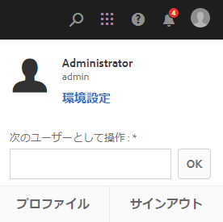

# AEM デスクトップアプリケーション v1.x の使用 {#use-aem-desktop-app-v1x}

AEM デスクトップアプリケーションを使用すれば、AEM 内のアセットにローカルデスクトップから手軽にアクセスし、任意のデスクトップアプリケーションで利用できます。アセットを Mac Finder や Windows エクスプローラーで容易に表示し、デスクトップアプリケーションで開いて、ローカルで変更できます。変更内容は AEM に保存され、リポジトリ内に新しいバージョンが作成されます。

このような統合により、組織内の様々な役割のユーザーが AEM Assets でアセットを一元管理し、Creative Cloud やその他のアプリケーションからアセットにアクセスできるようになります。さらに、ブランディングなど様々な基準に準拠することが容易になります。

AEM デスクトップアプリケーションv1 を使用しておこなう主なタスクは次のとおりです。

1. [AEM サーバーと接続する](#installandconnect)
1. [アセットをデスクトップで直接開く](#openondesktop)
1. [アセットをデスクトップから編集およびチェックアウトする](#workonassets)
1. [アセットおよびフォルダーを一括アップロードする](#bulkupload)

様々な推奨事項や注意事項については、[アプリケーションを使用する際のベストプラクティス](best-practices-for-v1.md)を参照してください。If you face issues using the App, see how to [troubleshoot AEM desktop](troubleshoot-app-v1.md).

>[!NOTE]
>
>AEM デスクトップアプリケーションは AEM 6.1 リリースで導入され、当初は AEM Assets Companion App と呼ばれていました。

## AEM desktop app touch-points in the creative workflow {#aem-desktop-app-touch-points-in-the-creative-workflow}

AEM デスクトップアプリケーションおよび AEM Assets はクリエイティブワークフローで統合され、以下のタッチポイントが提供されます。

クリエイティブワークフローでの AEM デスクトップアプリケーションのタッチポイント

## AEM デスクトップアプリケーションのインストールと AEM サーバーへの接続 {#installandconnect}

クリエイティブアセットの作成または編集を開始する前に、リポジトリのアセットをダウンロードおよびアップロードするために AEM デスクトップアプリケーションを AEM Assets サーバーに接続します。以下の作業をおこないます。

1. [アプリをインストールします](#installapp)。
1. [環境設定](#inapppref)および接続の詳細を設定します。
1. [AEM サーバーに接続](#connect)し、アセットリポジトリをローカルドライブとしてマウントします。
1. AEM サーバーで[「デスクトップアクション」を有効にします。](#desktopactions)

AEM デスクトップアプリケーションは、安全かつ堅牢にアセットを転送するために、AEM サーバーへの接続に HTTPS 接続を使用します。

>[!NOTE]
>インストールおよび設定手順の一部または全体で、AEM 管理者またはシステム管理者のサポートが必要になることがあります。

### アプリケーションのインストール {#installapp}

AEM デスクトップアプリケーションを使用するには、AEM サーバーのバージョンが AEM デスクトップアプリケーションでサポートされていることを確認します。使用するオペレーティングシステム（Mac または Windows）に適したインストールファイル（バイナリ）をダウンロードして、アプリケーションをインストールします。

ネットワークおよびシステムの環境設定によっては、詳細な設定が必要になることがあります。詳しくは、[AEM デスクトップアプリケーションのインストールと設定](install-configure-app-v1.md)を参照してください。

1. [AEM デスクトップアプリケーションのダウンロードページ](https://helpx.adobe.com/jp/experience-manager/kb/download-companion-app.html)に移動し、オペレーティングシステムに適したバイナリをダウンロードします。
1. ダウンロードしたインストールファイルを実行し、画面上の指示に従ってアプリケーションをインストールします。

   >[!NOTE]
   >インストールして一度にアクティブ化できる AEM デスクトップアプリケーションのインスタンスは 1 つだけです。

### アプリケーション内のオプションと環境設定について {#inapppref}

アプリケーションでは、AEM サーバーとの接続および切断、アップロードのステータスの表示、ローカルキャッシュの管理などの設定をおこなうことができます。通常は、デフォルト設定で使用することができます。必要に応じて、アプリケーションや AEM サーバーとの統合について詳細な設定をおこなうことができます。以下では、様々な設定について詳しく説明します。

**Explore Assets**：AEM Assets リポジトリをマウントしたローカルドライブを開きます。つまり、ローカルマシンで利用できるようになったアセットを参照します。

**View Asset Status**：変更したアセットを AEM Assets リポジトリにアップロードしたり、新しいアセットを追加したりするときは、アセットがバックグラウンドでアップロードされます。バックグラウンドで処理されるので、サイズの大きいアセットでもアップロード完了まで待つ必要がなくなり、円滑な作業が可能になります。ユーザーは変更内容をローカルで保存するだけで、他に何かする必要はありません。これらのアセットをアプリケーションからサーバーに送信するには、ある程度の時間がかかります（利用可能な帯域幅によります）。アップロードのステータスや、その他いくつかの基本情報を確認できます。

**Options**：AEM デスクトップアプリケーショントレイから「Options」をクリックまたはタップすると、システム起動時にアプリケーションを起動したり、アプリケーション起動時に AEM サーバーに接続したり、マウント後に AEM Assets を利用できるローカルドライブ文字を変更したりする設定にアクセスできます。

**Advanced／Manage Cache**：ローカルキャッシュに使用するディスク容量を管理できます。AEM Assets サーバーのアーティファクトはローカルにキャッシュされ、スムーズに利用することができます。要件に応じてデフォルト設定を変更することができます。キャッシュをクリアして、すべてのアセットを取得し直すこともできます。キャッシュをクリアした場合でも、未保存の変更内容は維持されます。AEM サーバーにチェックインしていないアセットは、削除されずにそのまま保持されます。

### AEM サーバーへの接続 {#connect}

アプリは、Windows および Mac のプロキシ設定をサポートします。設定はアプリの起動時に読み込まれます。プロキシ設定を変更した場合は、変更を適用するためにアプリを再起動します。

>[!NOTE]
>
>プロキシ設定を変更した場合は、変更を適用するためにアプリを再起動します。それ以外の場合、アプリは設定済みのプロキシサーバーを引き続き使用します。

1. AEM デスクトップアプリケーションを起動します。アプリケーションに AEM インスタンスをマッピングするには、AEM サーバーを `https://[aem-server-url]:[port]` の形式で指定します。

   

1. ログイン画面で、インスタンスのユーザー名とパスワードを指定します。別の AEM インスタンスを指定するには、「**[!UICONTROL Alternate Login URL]**」オプションを選択します。

   

### AEM Web インターフェイスでのデスクトップアクションの有効化 {#desktopactions}

アセットユーザインターフェイス内から、アセットの場所を調べたり、アセットをチェックアウトして開き、デスクトップアプリケーションで編集することができます。 これらのオプションはデスクトップアクションと呼ばれ、デフォルトでは有効になっていません。 デスクトップアクションを有効にするには、以下の手順に従います。

1. アセットインターフェイスで、ツールバーの右上隅にあるユーザアイコンをクリックまたはタップします。
1. をクリック **[!UICONTROL My Preferences]** して、ダイアログを表 **[!UICONTROL Preferences]** 示します。

   

1. ユーザーの環境設定ダイアログで、「**[!UICONTROL Show Desktop Actions For Assets]**」を選択します。「**[!UICONTROL Accept]**」をクリックします。

   

   *図：「アセットのデスクトップアクションを表示」をオンにして、デスクトップアクションを有効にします。*

## デスクトップでのアセットへのアクセスとオープン {#openondesktop}

「開く」をクリック **して** 、ローカルマシン上のアセットを開くと、アプリはそのアセットを内部キャッシュにダウンロードします。 ダウンロードしたアセットのファイルタイプに関連付けられたネイティブデスクトップアプリケーションがアプリケーションによって起動されます。

On Mac, select **Open** from the context menu to open an asset through AEM desktop app. Windows の場合は、コンテキストメニューで「Open on Web」を選択してアセットを開きます。アセットステータスウィンドウで  をクリックまたはタップして、アセットを開きます。

Adobe InDesign（INDD）ファイルでは、コンテキストメニューで「**[!UICONTROL Open]**」を選択します。このオプションをクリックすると、リンクされているアセットが AEM デスクトップアプリケーションによってローカルファイルシステムにダウンロードされ、Adobe InDesign で INDD ファイルが表示されます。この方法を使用することで、INDD ファイルを編集するときに必要なアセットをローカルで利用できます。

*図：AEMデスクトップアプリを使用してアセットにアクセスし、開くためのコンテキストメニューオプション。*

>[!NOTE]
>Windows の場合、[Windows 7 のデフォルト設定](https://support.microsoft.com/ja-jp/kb/2668751)では、50 MB より大きなアセットを AEM デスクトップアプリケーションで処理できません。

>[!NOTE]
>
>MacのFinder表示オプションに移動し、マウントされたAEM Assetsプレビューの「項目を表示」、「項目情報を表示 **」、「********** プレビューを表示」列の各オプションを非アクティブにすることをお勧めします。 パフォーマンスが向上します。

### AEMインターフェイスの追加オプション {#additional-options-in-aem-assets}

AEM Assets リポジトリをローカルドライブにマッピングした後で、マッピングされたアセットとフォルダーに対して追加のアイコンと「フォルダーのアップロード」機能が表示されるように設定できます。

1. AEM Assets インターフェイスを開き、フォルダーまたはアセットの上にマウスポインターを置くと、デスクトップアクションがカード表示のクイックアクションとして表示されます。

   

   *図：アセットUIで、クイックアクションメニューを開いて、デスクトップアクションを表示します。*

   These desktop actions are also available when you click the **Desktop Actions** icon in the toolbar after selecting the asset or from the toolbar in the asset page.

1. 特定のファイル拡張子に関連付けられているデスクトップアプリケーションでアセットを表示するには、「**デスクトップで開く**」クイックアクション  をクリックまたはタップします。

   または、ツールバーの&#x200B;**デスクトップアクション**&#x200B;メニューから「**開く**」を選択します。

ローカルファイルシステム上の特定のアセットを検索するには、クイックアクションを表示 **します** 。表示アイコン 。 または、ツールバーの&#x200B;**デスクトップアクション**&#x200B;メニューから「**表示**」を選択します。

## アセットのステータスについて {#understand-the-asset-statuses}

|  | AEM デスクトップアプリケーションはサーバーに接続されており、すべてのアセットが同期されています。 |
|------|-----------------------------------------------------------------------------------------------------------------------------------------------------------|
|  | AEM デスクトップアプリケーションは起動していますが、サーバーに接続されていません。一部のアセットの同期が保留されている可能性があります。 |
|  | アセットの同期中です。ファイルはアップロード中またはダウンロード中です。Asset Status ウィンドウで、ステータスの詳細を確認し、転送を一時停止できます。 |
|  | AEM デスクトップアプリケーションは再接続を試みています。ネットワークの問題が発生し、切断された可能性があります。 |

## アセットの操作 {#workonassets}

### AEM Web インターフェイスからのアセットのチェックアウト {#check-out-assets-from-the-aem-web-interface}

AEM Assets では、編集のためにアセットをチェックアウトし、変更終了後にアセットをチェックインすることができます。アセットをチェックアウトした後は、その人だけがアセットを編集、注釈、公開、移動、削除できるようになります。アセットをチェックアウトすると、そのアセットがロックされ、他のユーザーはそのアセットに対する操作ができなくなります。アセットをチェックイン／チェックアウトするには、アセットへの書き込み権限が必要です。

AEM Web インターフェイスからアセットをチェックアウトするには、2 つの方法があります。1 つ目の方法について詳しくは、[Assets UI からのファイルのチェックインとチェックアウト](https://docs.adobe.com/content/help/en/experience-manager-65/assets/managing/check-out-and-submit-assets.html)を参照してください。AEM デスクトップアプリケーションがインストールされている場合にアセットをチェックアウトして開く 2 つ目の方法を使用するには、以下の手順に従います。

1. AEM Assets インターフェイスを開き、フォルダーまたはアセットの上にマウスポインターを置くと、デスクトップアクションがカード表示のクイックアクションとして表示されます。

   

   これらのデスクトップアクションは、アセットを選択した後のツールバー、またはアセットページにあるツールバーの「デスクトップアクション」アイコンをクリックまたはタップしても使用できます。

1. アセットを開くには、「デスクトップで開く」クイックアクション  をクリックまたはタップします。

   または、ツールバーのデスクトップアクションメニューから「開く」を選択します。

   >[!NOTE]
   >開いただけでチェックアウトしていないファイルを編集した場合、他のユーザーにはそのアセットが更新されていることは通知されません。

1. アセットを開いて Adobe Creative Cloud アプリケーションで編集するには、「デスクトップを編集」クイックアクションをクリックまたはタップします。この操作により、アセットが編集のためにチェックアウトされます。編集が終了したら、アセットをチェックインして、AEM Assets で変更を更新します。

   または、ツールバーのデスクトップアクションメニューから「編集」を選択します。

1. 「開く」メニューオプションを選択します。選択したアセットがプレビューモードで開きます。
1. アセットを編集するには、「編集」オプションを選択します。選択したアセットが編集モードで開きます。

### Mac OSでのFinderからのアセットのチェックアウト {#check-out-assets-on-mac}

AEM デスクトップアプリケーションでは、作業中のファイルが他のユーザーによって変更されないように、アセットファイルをチェックアウトできます。

1. Mac のコンテキストメニューの「Open AEM Assets Folder」を選択して Finder を開きます。

   

   AEM デスクトップアプリケーションを使用してアセットにアクセスして開くためのコンテキストメニューオプション

1. チェックアウトするアセットに移動します。

   

1. アセットを右クリックし、コンテキストメニューの「More Assets Info」を選択します。
1. Asset Info ダイアログで、「Checkout」アイコンをクリックまたはタップして、アセットをチェックアウトします。「Checkout」アイコンは、クリックまたはタップすると、「Check-in」アイコンに変わります。

   

1. 他のユーザーが使用できるようにアセットをチェックインするには、Asset Info ダイアログの「Check-in」アイコンをクリックまたはタップします。

### アセットのチェックアウト（Windows の場合） {#check-out-assets-on-windows}

AEM デスクトップアプリケーションでは、作業中のファイルが他のユーザーによって変更されないように、アセットファイルをチェックアウトできます。

1. コンテキストメニューの「Explore Assets」を選択してエクスプローラーを開きます。
1. エクスプローラーで、チェックアウトするアセットの場所に移動します。

   

1. アセットを右クリックし、コンテキストメニューの「Open on Web」を選択します。
1. Asset Info ダイアログで、「Checkout」アイコンをクリックまたはタップします。「Checkout」アイコンが「Check-in」アイコンに変わります。

   

1. エクスプローラーでアセットを確認します。アセットのロックアイコン  は、このアセットをチェックアウトしていることを示します。

   >[!NOTE]
   >ロックアイコンは、しばらくすると表示される場合があります。 AEMデスクトップアプリケーションは、すばやくアクセスできるようにアセットをキャッシュして、ロックされたステータスを更新するのに数分かかる場合があります。

1. 他のユーザーが使用できるようにアセットをチェックインするには、**Asset Info** ダイアログの「Check-in」アイコンをクリックまたはタップします。

### Finder またはエクスプローラー、および Web インターフェイスを使用したアセットのチェックイン {#check-in-an-asset-using-finder-or-explorer-and-using-web-interface}

アセットの編集が終了したら、デスクトップアプリケーションでアセットを保存します。From the context menu, select **More Assets Info** and click check-in.

アセットが AEM サーバーにアップロードされます。Optionally, you can check the status of the upload by selecting **View Asset Status** from the system tray icon. または、AEM Web インターフェイスからアセットをチェックインすることもできます。チェックアウトしたアセットをクリックするか、選択します。 From the toolbar, click the check in icon .

変更がローカルに保存されると、アセットが自動的にAEMにアップロードされます。 このチェックインにより、他のAEMユーザーがアセットを編集できるようになります。

### AEM サーバーへのアセットおよびフォルダーの一括アップロード {#bulkupload}

AEM Desktop では、アセットを含むフォルダー全体を、ローカルファイルディレクトリから AEM Assets にアップロードできます。この方法では、フォルダー内のすべてのアセットが一度にアップロードされ、ファイルを 1 つずつアップロードする必要はありません。

1. アセット UI で、ツールバーの「**作成**」をクリックまたはタップし、メニューから「**アップロードフォルダー**」を選択します。
1. アップロードするフォルダーに移動し、そのフォルダーを選択します。
1. 「OK」をクリックまたはタップします。Assets Status ダイアログにアップロードのステータスが表示されます。

   

   Assets Status ウィンドウでのアップロードのステータスの確認

   >[!NOTE]
   >該当するアイコンをクリックまたはタップして、アップロードを手動で一時停止またはキャンセルすることができます。

1. フォルダーがアップロードされたら、ダイアログを閉じて、Assets UI に移動します。アップロードされたフォルダーが Web インターフェイスに表示されます。

アドビでは、ローカルファイルシステムからネットワーク共有領域に、より多くのファイルやネストされたフォルダーをコピー&amp;ペーストまたはドラッグしないことをお勧めします。 技術的な制限があるため、アプリはアップロード処理を制御できず、パフォーマンスが低下しています。

または、FinderまたはExplorerでAEMにアップロードするファイルやターゲットを選択し、システムクリップボードにコピーし、ネットワーク共有領域のフォルダに移動し、AEMデスクトップアプリのコンテキストメニューから「アセットを貼り付け ****」を選択します。 これにより、AEMデスクトップアプリの開始は、AEM Webインターフェイスで使用できる「フォルダーをア **ップロード** 」オプションと同様に、貼り付けたアセットをアップロードします。

>[!MORELIKETHIS]
>
>* [AEM デスクトップアプリケーションの概要](https://helpx.adobe.com/customer-care-office-hours/aem/desktop-app.html)
>* [AEMデスクトップアプリケーションのチェックイン/チェックアウトについて理解する](https://docs.adobe.com/content/help/en/experience-manager-learn/assets/collaboration/checkin-checkout-technical-video-understand.html)
>* [AEMデスクトップアプリケーションのトラブルシューティング](troubleshoot-app-v1.md)

