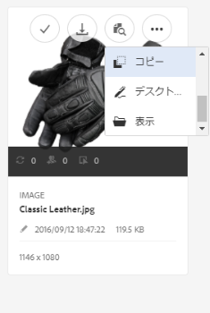

# Use [!DNL Experience Manager] desktop app v1.x {#use-aem-desktop-app-v1x}

Using the App, the assets within [!DNL Experience Manager] are easily accessible on your local desktop and can be used in any desktop applications. Assets can be easily revealed in Mac Finder or Windows Explorer, opened in desktop applications, and changed locally - the changes are saved back to [!DNL Experience Manager] with a new version created in the repository.

このような統合により、組織内の様々な役割のユーザーが Assets でアセットを一元管理し、Creative Cloud やその他のアプリケーションからアセットにアクセスできるようになります。さらに、ブランディングなど様々な基準に準拠することが容易になります。

The key tasks you do using the [!DNL Experience Manager] desktop app v1 include:

1. [ [!DNL Experience Manager]  サーバーと接続する](#installandconnect)
1. [アセットをデスクトップで直接開く](#openondesktop)
1. [アセットをデスクトップから編集およびチェックアウトする](#workonassets)
1. [アセットおよびフォルダーを一括アップロードする](#bulkupload)

様々な推奨事項や注意事項については、[アプリケーションを使用する際のベストプラクティス](best-practices-for-v1.md)を参照してください。If you face issues using the App, see how to [troubleshoot [!DNL Experience Manager] desktop](troubleshoot-app-v1.md).

>[!NOTE]
>
>[!DNL Experience Manager] デスクトップアプリは、 [!DNL Experience Manager] 6.1リリースで導入され、呼び出されました [!DNL Experience Manager Assets Companion App]。

## [!DNL Experience Manager]クリエイティブワークフローでの デスクトップアプリケーションのタッチポイント {#aem-desktop-app-touch-points-in-the-creative-workflow}

[!DNL Experience Manager] デスクトップアプリは、クリエイティブワークフロー [!DNL Assets]とオファーに次のタッチポイントと共に統合されます。

![[!DNL Experience Manager] デスクトップアプリケーションのタッチポイントクリエイティブワークフロー](assets/aem_desktopapp_workflow.png)

[!DNL Experience Manager] デスクトップアプリケーションのタッチポイントクリエイティブワークフロー

## アプリケーションをインストールし、サー [!DNL Experience Manager] バーに接続します {#installandconnect}

Before you can begin creating or editing the creative assets, connect the desktop application with the [!DNL Assets] server to download and upload assets in the repository. 以下の作業をおこないます。

1. [アプリをインストールします](#installapp)。
1. [環境設定](#inapppref)および接続の詳細を設定します。
1. [ [!DNL Experience Manager]  サーバーに接続](#connect)し、アセットリポジトリをローカルドライブとしてマウントします。
1.  サーバーで[「デスクトップアクション」を有効にします。](#desktopactions)[!DNL Experience Manager]

[!DNL Experience Manager] デスクトップアプリケーションは、安全かつ堅牢にアセットを転送するために、 サーバーへの接続に HTTPS 接続を使用します。[!DNL Experience Manager]

>[!NOTE]
>
>For part of or all of the installation and configuration steps, you may need help from your [!DNL Experience Manager] administrator or system administrator.

### アプリケーションのインストール {#installapp}

To use [!DNL Experience Manager] desktop app, ensure that your [!DNL Experience Manager] server version is supported by the app. 使用するオペレーティングシステム（Mac または Windows）に適したインストールファイル（バイナリ）をダウンロードして、アプリケーションをインストールします。

ネットワークおよびシステムの環境設定によっては、詳細な設定が必要になることがあります。See [Install and configure [!DNL Experience Manager] desktop app](install-configure-app-v1.md) for more details.

1. Go to the [[!DNL Experience Manager] desktop app download page](https://helpx.adobe.com/jp/experience-manager/kb/download-companion-app.html) and download the appropriate binary for your operating system.
1. ダウンロードしたインストールファイルを実行し、画面上の指示に従ってアプリケーションをインストールします。

   >[!NOTE]
   >
   >Only one instance of the [!DNL Experience Manager] desktop app can be installed and be active at a time.

### アプリケーション内のオプションと環境設定について {#inapppref}

The application allows for settings to connect and disconnect from [!DNL Experience Manager] servers, view status of uploads, manage local cache, and so on. 通常は、デフォルト設定で使用することができます。You can tweak the settings to get more out of the application and out of the integration with [!DNL Experience Manager] server. 以下では、様々な設定について詳しく説明します。

**Explore Assets**[!DNL Assets]： リポジトリをマウントしたローカルドライブを開きます。つまり、ローカルマシンで利用できるようになったアセットを参照します。

**View Asset Status**[!DNL Assets]：変更したアセットを リポジトリにアップロードしたり、新しいアセットを追加したりするときは、アセットがバックグラウンドでアップロードされます。バックグラウンドで処理されるので、サイズの大きいアセットでもアップロード完了まで待つ必要がなくなり、円滑な作業が可能になります。ユーザーは変更内容をローカルで保存するだけで、他に何かする必要はありません。これらのアセットをアプリケーションからサーバーに送信するには、ある程度の時間がかかります（利用可能な帯域幅によります）。アップロードのステータスや、その他いくつかの基本情報を確認できます。

**オプション** ：デスクトップアプリケーションのトレイにあるオプションをクリックして設定にアクセスし、システム開始が起動したときにアプリケーションを起動します。を呼び出して、アプリケーションを起動したときに [!DNL Experience Manager] サーバーに接続します。マウント後に使用可能なローカルドライブ文字を変更 [!DNL Assets] する。

**Advanced／Manage Cache**：ローカルキャッシュに使用するディスク容量を管理できます。The artifacts from the [!DNL Assets] server are cached locally for a smoother experience. 要件に応じてデフォルト設定を変更することができます。キャッシュをクリアして、すべてのアセットを取得し直すこともできます。キャッシュをクリアした場合でも、未保存の変更内容は維持されます。Any assets not checked into [!DNL Experience Manager] server are retained and not deleted.

### Connect to an [!DNL Experience Manager] server {#connect}

アプリは、Windows および Mac のプロキシ設定をサポートします。設定はアプリの起動時に読み込まれます。プロキシ設定を変更した場合は、変更を適用するためにアプリを再起動します。

>[!NOTE]
>
>プロキシ設定を変更した場合は、変更を適用するためにアプリを再起動します。それ以外の場合、アプリは設定済みのプロキシサーバーを引き続き使用します。

1. Launch [!DNL Experience Manager] desktop app. To map your [!DNL Experience Manager] instance with the app, specify your [!DNL Experience Manager] server in the format `https://[aem-server-url]:[port]`.

   ![[!DNL Experience Manager]Mac での認証と サーバー URL の提供](assets/aem_desktop_app_server_url.png)

1. ログイン画面で、インスタンスのユーザー名とパスワードを指定します。To specify an alternate [!DNL Experience Manager] instance, select the **[!UICONTROL Alternate Login URL]** option.

   ![[!DNL Experience Manager][!DNL Experience Manager] デスクトップアプリケーションのログイン画面での サーバーの資格情報の入力](assets/login_screen_v1.png)

### Enable desktop actions in [!DNL Experience Manager] web interface {#desktopactions}

Assets ユーザーインターフェイスから、アセットの場所を参照したり、アセットをチェックアウトしてデスクトップアプリケーションで編集用に開くことができます。これらのオプションはデスクトップアクションと呼ばれており、デフォルトでは有効になっていません。デスクトップアクションを有効にするには、以下の手順に従います。

1. Assets インターフェイスで、ツールバーの右上隅にあるユーザーアイコンをクリックまたはタップします。
1. 「**[!UICONTROL My Preferences]**」をクリックして、**[!UICONTROL Preferences]** ダイアログを表示します。

   ![[!DNL Experience Manager] ユーザーの環境設定とのインターフェイス](assets/aem_ui_user_preferences.png)

1. ユーザーの環境設定ダイアログで、「**[!UICONTROL Show Desktop Actions For Assets]**」を選択します。「**[!UICONTROL Accept]**」をクリックします。

   ![「[!UICONTROL Show Desktop Actions For Assets]」をオンにすると、デスクトップアクションが有効になります。](assets/enable_desktop_actions.png)

   *図：「アセットのデスクトップアクションを表示」をチェックしてデスクトップアクションを有効化*

## デスクトップでのアセットへのアクセスとオープン {#openondesktop}

「**開く**」をクリックしてローカルマシンでアセットを開くと、アプリケーションの内部キャッシュにアセットがダウンロードされます。ダウンロードされたアセットのファイルタイプに関連付けられているネイティブデスクトップアプリケーションが起動されます。

Mac の場合は、コンテキストメニューで「**Open**」を選択し、 デスクトップアプリケーションを通じてアセットを開きます。[!DNL Experience Manager]Windows の場合は、コンテキストメニューで「Open on Web」を選択してアセットを開きます。アセットステータスウィンドウでをクリックまたはタップして、アセットを開きます。

Adobe InDesign（INDD）ファイルでは、コンテキストメニューで「**[!UICONTROL Open]**」を選択します。このオプションをクリックすると、リンクされているアセットが AEM デスクトップアプリケーションによってローカルファイルシステムにダウンロードされ、Adobe InDesign で INDD ファイルが表示されます。この方法を使用することで、INDD ファイルを編集するときに必要なアセットをローカルで利用できます。

![デスクトップアプリを使用してアセットにアクセスし、開くためのコンテキストメニューオプション [!DNL Experience Manager]](assets/aem_desktopapp_mac_context_menu.png)

*[!DNL Experience Manager]図： デスクトップアプリケーションを使用してアセットにアクセスし開くためのコンテキストメニューオプション*

>[!NOTE]
>
>Windows の場合、[Windows 7 のデフォルト設定](https://support.microsoft.com/ja-jp/kb/2668751)では、50 MB より大きなアセットを デスクトップアプリケーションで処理できません。[!DNL Experience Manager]

>[!NOTE]
>
>Mac で Finder の表示オプションに移動し、マウントされた フォルダーの「**Show item info**」、「**Show item preview**」、「**Show preview column**」の各オプションを無効にすることをお勧めします。[!DNL Assets]それにより、パフォーマンスが向上します。

### Additional options in [!DNL Experience Manager] interface {#additional-options-in-aem-assets}

After you map the [!DNL Assets] repository to your local drive, you can enable additional icons and the Folder Upload feature to appear for the mapped assets and folders.

1. Open the [!DNL Assets] interface and hover the pointer over a folder or an asset, to display the desktop actions as quick actions in the Card view.

   

   *図：Assets UI でクイックアクションメニューを開いてデスクトップアクションを表示したところ*

   これらのデスクトップアクションは、アセットを選択した後のツールバー、またはアセットページにあるツールバーの「**デスクトップアクション**」オプションをクリックしても使用できます。

1. 特定のファイル拡張子に関連付けられているデスクトップアプリケーションでアセットを表示するには、「**デスクトップで開く**」クイックアクションをクリックします。

   または、ツールバーの&#x200B;**デスクトップアクション**&#x200B;メニューから「**開く**」を選択します。

ローカルファイルシステム上で特定のアセットを見つけるには、「**Reveal**」クイックアクション をクリックします。または、ツールバーの&#x200B;**デスクトップアクション**&#x200B;メニューから「**表示**」を選択します。

## アセットのステータスについて {#understand-the-asset-statuses}

|  | AEM デスクトップアプリケーションはサーバーに接続されており、すべてのアセットが同期されています。 |
--- |--- |
|  | AEM デスクトップアプリケーションは起動していますが、サーバーに接続されていません。一部のアセットの同期が保留されている可能性があります。 |
|  | アセットの同期中です。ファイルはアップロード中またはダウンロード中です。Asset Status ウィンドウで、ステータスの詳細を確認し、転送を一時停止できます。 |
|  | AEM デスクトップアプリケーションは再接続を試みています。ネットワークの問題が発生し、切断された可能性があります。 |

## アセットの操作 {#workonassets}

### Check out assets from the [!DNL Experience Manager] web interface {#check-out-assets-from-the-aem-web-interface}

[!DNL Assets] では、編集のためにアセットをチェックアウトし、変更終了後にアセットをチェックインすることができます。アセットをチェックアウトした後は、その人だけがアセットを編集、注釈、公開、移動、削除できるようになります。アセットをチェックアウトすると、そのアセットがロックされ、他のユーザーはそのアセットに対する操作ができなくなります。アセットをチェックイン／チェックアウトするには、アセットへの書き込み権限が必要です。

There are two ways of checking out assets from the [!DNL Experience Manager] web interface. 1 つ目の方法について詳しくは、[Assets UI からのファイルのチェックインとチェックアウト](https://experienceleague.adobe.com/docs/experience-manager-65/assets/managing/check-out-and-submit-assets.html?lang=ja)を参照してください。Follow these steps, for the second methods to check out and open the asset when [!DNL Experience Manager] desktop app is installed.

1. Open the [!DNL Assets] interface and hover the pointer over a folder or an asset, to display the desktop actions as quick actions in the Card view.

   

   これらのデスクトップアクションは、アセットを選択した後のツールバー、またはアセットページにあるツールバーの「デスクトップアクション」アイコンをクリックまたはタップしても使用できます。

1. アセットを開くには、「デスクトップで開く」クイックアクションをクリックまたはタップします。

   または、ツールバーのデスクトップアクションメニューから「開く」を選択します。

   >[!NOTE]
   >
   >開いただけでチェックアウトしていないファイルを編集した場合、他のユーザーにはそのアセットが更新されていることは通知されません。

1. アセットを開いて Adobe Creative Cloud アプリケーションで編集するには、「デスクトップを編集」クイックアクションをクリックまたはタップします。この操作により、アセットが編集のためにチェックアウトされます。After you finish editing, check in the asset, to update the changes in [!DNL Assets].

   または、ツールバーのデスクトップアクションメニューから「編集」を選択します。

1. 「開く」メニューオプションを選択します。選択したアセットがプレビューモードで開きます。
1. アセットを編集するには、「編集」オプションを選択します。選択したアセットが編集モードで開きます。

### Mac OS Finder からのアセットのチェックアウト {#check-out-assets-on-mac}

AEM デスクトップアプリケーションでは、作業中のファイルが他のユーザーによって変更されないように、アセットファイルをチェックアウトできます。

1. Macのコンテキストメニューで、「AEM Assetsフォルダを開く」オプションを選択して、Finderを開きます。

   ![デスクトップアプリを使用してアセットにアクセスし、開くためのコンテキストメニューオプション [!DNL Experience Manager]](assets/aem_desktopapp_mac_context_menu.png)

   *[!DNL Experience Manager]図： デスクトップアプリケーションを使用してアセットにアクセスし開くためのコンテキストメニューオプション*

1. チェックアウトするアセットに移動します。
1. アセットを右クリックし、コンテキストメニューの「More Assets Info」を選択します。
1. Asset Info ダイアログで、「Checkout」アイコンをクリックまたはタップして、アセットをチェックアウトします。「Checkout」アイコンは、クリックまたはタップすると、「Check-in」アイコンに変わります。

   

1. 他のユーザーが使用できるようにアセットをチェックインするには、Asset Info ダイアログの「Check-in」アイコンをクリックまたはタップします。

### アセットのチェックアウト（Windows の場合） {#check-out-assets-on-windows}

AEM デスクトップアプリケーションでは、作業中のファイルが他のユーザーによって変更されないように、アセットファイルをチェックアウトできます。

1. コンテキストメニューの「Explore Assets」を選択してエクスプローラーを開きます。
1. エクスプローラーで、チェックアウトするアセットの場所に移動します。
1. アセットを右クリックし、コンテキストメニューの「Open on Web」を選択します。
1. Asset Info ダイアログで、「Checkout」アイコンをクリックまたはタップします。「Checkout」アイコンが「Check-in」アイコンに変わります。

   

1. エクスプローラーでアセットを確認します。アセットのロックアイコンは、このアセットをチェックアウトしていることを示します。

   >[!NOTE]
   >
   >ロックアイコンは、少し遅れて表示される場合があります。[!DNL Experience Manager] デスクトップアプリケーションは、すばやくアクセスできるようにアセットをキャッシュするので、ロック済みのステータスが更新されるまでにしばらく時間がかかることがあります。

1. 他のユーザーが使用できるようにアセットをチェックインするには、**Asset Info** ダイアログの「Check-in」アイコンをクリックまたはタップします。

### Finder またはエクスプローラー、および Web インターフェイスを使用したアセットのチェックイン {#check-in-an-asset-using-finder-or-explorer-and-using-web-interface}

アセットの編集が終了したら、デスクトップアプリケーションでアセットを保存します。コンテキストメニューで「**More Assets Info**」を選択して、「Check-in」をクリックします。

The assets are uploaded to [!DNL Experience Manager] server. オプションで、システムトレイアイコンから「**View Asset Status**」を選択して、アップロードのステータスを確認できます。Alternatively, you can check in an asset from the [!DNL Experience Manager] web interface. チェックアウトされたアセットをクリックするか選択します。ツールバーのチェックインアイコンをクリックします。

An asset is uploaded to [!DNL Experience Manager] automatically after any changes are saved locally. The check-in makes the asset available to other [!DNL Experience Manager] users for editing.

### Bulk upload assets and folders to [!DNL Experience Manager] server {#bulkupload}

Using [!DNL Experience Manager] desktop app, you can upload an entire folder containing assets from your local file directory to [!DNL Assets]. この方法では、フォルダー内のすべてのアセットが一度にアップロードされ、ファイルを 1 つずつアップロードする必要はありません。

1. アセット UI で、ツールバーの「**作成**」をクリックまたはタップし、メニューから「**フォルダーのアップロード**」を選択します。
1. アップロードするフォルダーに移動し、そのフォルダーを選択します。
1. 「OK」をクリックまたはタップします。Assets Status ダイアログにアップロードのステータスが表示されます。

   

   Assets Status ウィンドウでのアップロードのステータスの確認

   >[!NOTE]
   >
   >該当するアイコンをクリックまたはタップして、アップロードを手動で一時停止またはキャンセルすることができます。

1. フォルダーがアップロードされたら、ダイアログを閉じて、Assets UI に移動します。アップロードされたフォルダーが Web インターフェイスに表示されます。

アドビでは、多数のファイルやネストしたフォルダーをローカルファイルシステムからネットワーク共有領域にコピー＆ペーストしたりドラッグしたりしないことをお勧めします。技術的な制限により、アプリがアップロード処理を制御できず、パフォーマンスも低下するからです。

Alternatively, select files/folders you want to upload to [!DNL Experience Manager] in Finder or Explorer, copy them to system clipboard, navigate to the target folder in the network share area, and from the [!DNL Experience Manager] desktop app context menu select **Paste Assets**. This way, [!DNL Experience Manager] desktop app starts uploading the pasted assets similar to the **Upload Folder** option available in the [!DNL Experience Manager] web interface.

>[!MORELIKETHIS]
>
>* [ [!DNL Experience Manager]  デスクトップアプリケーションのトラブルシューティング](troubleshoot-app-v1.md)

