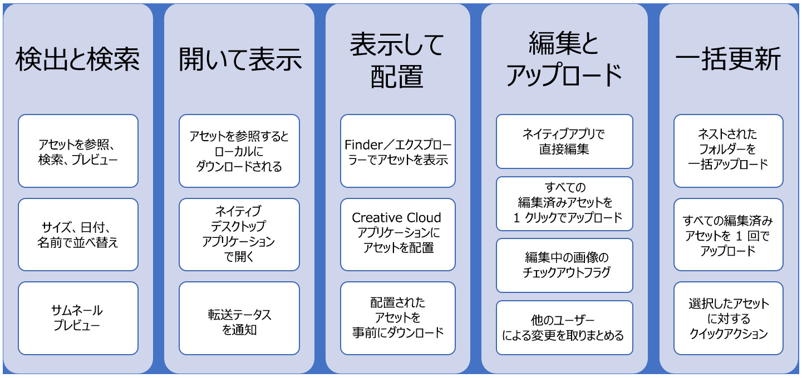
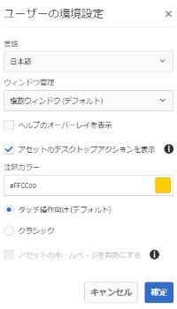
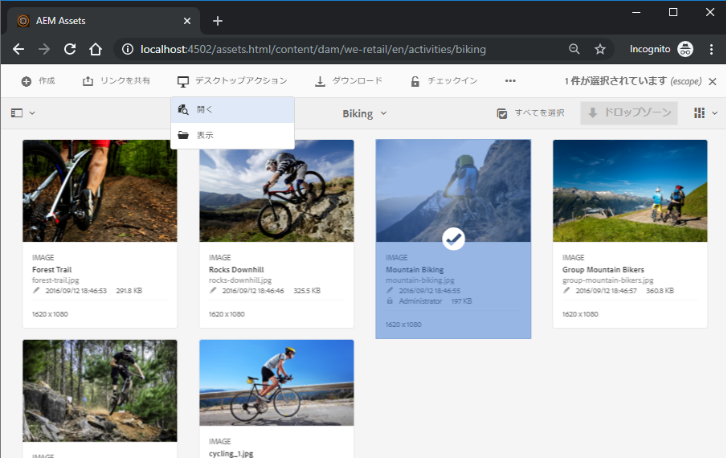

# Use AEM desktop app {#use-aem-desktop-app-v2}

Adobe Experience Manager(AEM)デスクトップアプリを使用すると、ローカルデスクトップ上のAEMアセットに簡単にアクセスして、これらのアセットをデスクトップアプリケーションで使用できます。 デスクトップアプリケーションでアセットを開き、アセットをローカルで編集して、バージョン管理を使用してAEMに変更をアップロードし直し、他のユーザーとアップデートを共有できます。 また、新しいファイルやフォルダー階層をAEMにアップロードしたり、フォルダーを作成したり、AEMからアセットやフォルダーを削除したりすることもできます。

この統合により、組織内の様々な役割がAEM Assetsでアセットを一元管理し、WindowsまたはMac OSのネイティブアプリケーションでローカルデスクトップ上のアセットにアクセスできます。

ログアウト後または初めてアプリケーションを開く場合は、AEMサーバーのURLを指定します。 「接続」をクリックします。アプリをサーバーに接続するための資格情報を指定します。

AEMデスクトップアプリケーションを使用して行う主なタスクは次のとおりです。

るタ  スク印刷可能なPDFファイルをダウンロードします。

## デスクトップアプリの仕組み {#how-app-works2}

アプリケーションを使用する前に、アプリケーションの [仕組みを理解しておきます](release-notes.md#how-app-works)。 また、次の用語についても理解してください。

* **[!UICONTROL Desktop Actions]**:アセットWebインターフェイスから、ブラウザー内からアセットの場所を調べたり、アセットをチェックアウトしてネイティブのデスクトップアプリケーションで編集用に開いたりできます。 これらのアクションはWebインターフェイスから使用でき、デスクトップアプリケーション機能を使用できます。 Desktop Actionsを有 [効にする方法を参照してください](using.md#desktopactions-v2)。

* ファイルの状態 **[!UICONTROL Cloud Only]**:このようなアセットは、ローカルマシンにダウンロードされず、AEMサーバーでのみ使用できます。

* ファイルの状態 **[!UICONTROL Available locally]**:アセットがダウンロードされ、ローカルマシン上でそのまま使用できます。 アセットは変更されません。

* ファイルの状態 **[!UICONTROL Edited locally]**:このようなアセットはローカルで変更され、変更はAEMサーバーにアップロードされた状態に残ります。 アップロード後、ステータスはに変わりま [!UICONTROL Available locally]す。 詳しくは、ア [セットの編集を参照してくださ](using.md#edit-assets-upload-updated-assets)い。

* ファイルの状態 **[!UICONTROL Editing conflict]**:自分と他のユーザーが同時にアセットを変更した場合、アプリは編集上の競合が発生したことを示します。 また、変更を保持または破棄するオプションも提供されます。 競合を [避ける方法を参照してください](using.md#adv-workflow-collaborate-avoid-conflicts)。

* ファイルの状態 **[!UICONTROL Modified remotely]**:ダウンロードしたアセットがAEMサーバー上で変更されたかどうかを示すアプリが表示されます。 また、最新バージョンをダウンロードしてローカルコピーを更新するオプションも提供されます。 競合を [避ける方法を参照してください](using.md#adv-workflow-collaborate-avoid-conflicts)。

* **チェックアウト**:ファイルを編集している場合、またはファイルを編集する場合は、ステータスをチェックアウトに切り替えます。 アプリケーションおよびAEM webインターフェイスのアセットに錠前のアイコンが追加されます。 ロックアイコンは、他のユーザに対して、編集の競合を引き起こすのと同じアセットを同時に編集しないように指示します。

* **チェックイン**:他のユーザーが編集上の競合を引き起こさずに編集できるように、アセットを安全としてマークします。 変更をアップロードすると、ロックアイコンが自動的に削除されます。 チェックインステータスを切り替えると、ロックアイコンも削除されますが、変更をアップロードせずに手動でチェックインしないことをお勧めします。 変更を破棄した場合は、手動でチェックインを切り替えます。

* **[!UICONTROL Open]** action:アセットを開いて、ネイティブアプリケーションでプレビューします。 アセットはチェックアウトされず、他のユーザーが編集を行って編集の競合が発生する可能性があるので、このアクションを使用してアセットを編集することはお勧めしません。

* **[!UICONTROL Edit]** action:アクションを使用して画像を変更します。 クリック [!UICONTROL Edit] 操作によってアセットが自動的にチェックアウトされ、アセットにロックアイコンが追加されます。 「編集」をクリックした後、アセットを編集しない場合は、をクリックしま [!UICONTROL Toggle check-in]す。 AEM DAMフォルダー階層内のアセットを削除、名前変更または移動するには、編集アクションではなく、AEM webインターフェイスアクションを使用します。

* **[!UICONTROL Download]** action:アセットをローカルマシンにダウンロードします。 アセットは今すぐダウンロードして、後で編集できます。オフラインで作業し、後で変更をアップロードします。 アセットは、ファイルシステム上のキャッシュフォルダーにダウンロードされます。

* **[!UICONTROL Reveal File]** またはア **[!UICONTROL Reveal Folder]** クション：アセットがローカルキャッシュフォルダーにダウンロードされる間、アプリはローカルネットワークドライブを模倣し、各アセットのローカルパスを提供します。 このパスを知るには、アプリで適切な表示オプションを使用します。 Creative cloudアプリケーションにアセットを配置するには、表示アクションが必要です。 アセットの配 [置を参照してください](using.md#place-assets-in-native-documents)。

* **[!UICONTROL Open In Web]** action:AEM webインターフェイスでアセットを表示するには、Webで開きます。 AEMインターフェイスから、メタデータの更新やアセットの検出など、さらに多くのワークフローを開始できます。

* **[!UICONTROL Delete]** action:AEM DAMリポジトリからアセットを削除します。 この操作により、AEMサーバー上のアセットの元のコピーが削除されます。 ローカルアセットに対する変更のみを破棄する場合は、変更の破棄を参照 [してください](using.md#edit-assets-upload-updated-assets)。

* **[!UICONTROL Upload Changes]**:デスクトップアプリは、AEMサーバーに明示的にアップロードする場合にのみ、更新されたアセットをアップロードします。 編集内容を保存すると、変更内容はローカルマシンにのみ保存されます。 アップロードすると、アセットが自動的にチェックインされ、ロックアイコンが削除されます。 詳しくは、ア [セットの編集を参照してくださ](using.md#edit-assets-upload-updated-assets)い。

## AEM Web インターフェイスでのデスクトップアクションの有効化 {#desktopactions-v2}

ブラウザーのアセットユーザーインターフェイス内から、アセットの場所を調べたり、アセットをチェックアウトして開き、デスクトップアプリケーションで編集できます。 These options are called [!UICONTROL Desktop Actions] and are not enabled by default. 有効にするには、次の手順に従います。

1. In the Assets console, click/tap the **[!UICONTROL User]** icon from the toolbar.
1. をクリック/タップして、 **[!UICONTROL My Preferences]** ダイアログを表示 **[!UICONTROL Preferences]** します。
1. ユーザ環境設定ダイアログで、を選択しま **[!UICONTROL Show Desktop Actions For Assets]**&#x200B;す。 クリック/タップしま **[!UICONTROL Accept]**&#x200B;す。

   

   デスクトップ [!UICONTROL Show Desktop Actions For Assets] の操作を有効にする場合にオンにします

## アセットの参照、検索およびプレビュー {#browse-search-preview-assets}

AEMリポジトリで使用可能なアセットを参照、検索およびプレビューするには、すべてデスクトップアプリケーション内から実行します。 アプリで次の操作を試します。

1. フォルダーを参照し、フォルダー内で使用可能なアセットの基本情報と、すべてのアセットの小さなサムネールを確認します。

   

1. 個々のアセットの詳細情報と大きいサムネールを表示するには、ファイル名をクリックします。

   

1. またはをク **[!UICONTROL Open]** リック **[!UICONTROL Edit]** して、ファイルをローカルにダウンロードし、それぞれネイティブアプリケーションで表示または編集するだけです。
1. キーワードを使用してAEMリポジトリ内の関連アセットを検索します。 ワイルドカ `?` ードとし `*` て、とを使用します。 これらのワイルドカードは、それぞれ1文字または複数文字に置き換えられます。 必要に応じて結果をフィルタリングし、並べ替えます。

   

   

>[!NOTE]
>
>アプリは、アセットのタイトルやファイル名だけでなく、複数のメタデータフィールドの検索条件を一致させてアセットを表示します。

## アセットのダウンロード {#download-assets}

アセットはローカルファイルシステムにダウンロードできます。 アプリはAEMサーバーからアセットを取得し、同じコピーをローカルファイルシステムに保存します。

オプションを表  」アイコンをクリックし、ダウンロ  」アイコンをクリックします。

>[!NOTE]
>
>大きなファイルまたは多数のファイルをダウンロードまたはアップロードすると、アセットとフォルダーに対するアクションがオフになります。 このアクションは、ダウンロードまたはアップロードが完了したときに使用できます。

キューのサイズが大きい場合や、ネットワークに問題が発生した場合、複数のアセットをダウンロードするとパフォーマンスが低下する可能性があります。 また、フォルダのダウンロード時に、多くのアセットを未知の状態でキューに格納してダウンロードすることもできます。 長い待ち時間を避けるために、1回の操作でダウンロードされるアセットの数が制限されます。 設定方法について詳しくは、環境設定の指定を参照 [してください](install-upgrade.md#set-preferences)。 この制限を下回っても、アプリは、明らかに大きなフォルダーをダウンロードする前に確認を求める場合があります。

フォルダーを選択してダウンロードした場合、アプリケーションはAEMのフォルダーに直接保存されているアセットのみをダウンロードします。 サブフォルダーからアセットが自動的にダウンロードされることはありません。

## デスクトップでアセットを開く {#openondesktop-v2}

リモートアセットを開いて、ネイティブアプリケーションで表示できます。 アセットがローカルフォルダーにダウンロードされ、ファイル形式に関連付けられたネイティブアプリケーションで起動します。 ネイティブアプリケーションを変更して、MacまたはWindowsで特定のファイルタイプ（拡張子）を開くことができます。

アセットメ **[!UICONTROL Open]** ニューからをクリックします。 アセットがローカルにダウンロードされ、ネイティブアプリケーションで開かれます。 ステータスバーで、大きなアセットのダウンロードの進行状況と転送速度を確認します。
<!-- 

-->

>[!NOTE]
>
>意図した変更がアプリに反映されない場合は、更新アイコン更新アイコンをク  、アプリインターフェイスで右クリックしてをクリックしま **[!UICONTROL Refresh]**&#x200B;す。 大きなダウンロードまたはアップロードが進行中の場合、アクションは使用できません。

アセットのローカルダウンロードフォルダを開くには、その他のアクションアイコンをク  」アイコンアク **[!UICONTROL Reveal File]** します。

## ネイティブドキュメントでのアセットの使用または配置 {#place-assets-in-native-documents}

ネイティブドキュメントにアセットを配置する場合、WindowsエクスプローラーまたはMac finderでファイルにアクセスする場合があります。 ローカルにダウンロードしたファイルのファイルシステムの場所に移動するには、「表示」アイコン **[!UICONTROL Reveal File]** します。

をクリ **[!UICONTROL Reveal File]**&#x200B;ックするか、 **[!UICONTROL Reveal Folder]** フォルダーをクリックして、ローカルマシン上で事前に選択されたファイルまたはフォルダーを使用してWindowsエクスプローラーまたはMac Finderを開きます。 このオプションは、ローカルファイルの配置やリンクをサポートするネイティブアプリケーションにAEMファイルを配置する場合などに役立ちます。 Adobe inDesignでファイルを配置する方法については、グラフィックの配置を参照 [してください](https://helpx.adobe.com/indesign/using/placing-graphics.html)。

この操 **[!UICONTROL Reveal File]** 作を実行すると、ローカルで使用可能なアセット（つまり、アプリを使用して表示、ダウンロードまたは開いた/編集されたアセット）のみが表示されるローカルネットワーク共有が開きます。 ローカルネットワーク共有は、AEMに対する変更をアップロードしません。 変更をアップロードするには、アプリで明示的 **[!UICONTROL Upload Changes]** にまたはア **[!UICONTROL Upload]** クションを使用します。

>[!NOTE]
>
>AEMデスクトップアプリケーションv1.xとの下位互換性を確保するため、表示されるファイルはローカルネットワーク共有から提供され、ローカルで使用できるファイルのみが公開されます。 表示されるファイルのデスクトップパスは、アプリケーションv1.xで作成されたパスと同じです。

>[!CAUTION]
>
>ネイティブアプリケーシ **[!UICONTROL Reveal File]** ョンでアセットを編集する場合は、このオプションを使用しないでください。 代わりに、アクションを使 **[!UICONTROL Edit]** 用します。 詳しくは、高度なワークフローを [参照してください。同じファイルで共同作業を行い、編集上の競合を回避](#adv-workflow-collaborate-avoid-conflicts)。

## アセットの編集と更新済みアセットのAEMへのアップロード {#edit-assets-upload-updated-assets}

変更を加え、更新したアセットをAEMサーバーにアップロードする際に、編集用にアセットを開きます。 他のユーザーの編集内容との競合を回避するには、アプリを使用して編集セッションを開始します。 編集を開始する前に、アセットにロックアイコンが付いていないこと、つまり別のユーザがアセットを編集していないことを確認します。

アセットを編集するには、アセットを検索するか、アセットの場所を参照します。 「詳細」ア  、をクリックしま **[!UICONTROL Edit]**&#x200B;す。

次の両 **[!UICONTROL Toggle Check-out]** 方の状況で他のユーザーの編集との競合を防ぐために、アセットをロックする場合に使用します。

* アセットをチェックアウトせずに（開くだけで）編集を開始した。
* アセットの編集はすぐに開始し、他のユーザーには編集されないようにする予定です。

編集が完了すると、変更されたアセットのステータスが **[!UICONTROL Edited Locally]** アプリに表示されます。 アセットに保存された変更は、AEMに変更をアップロードするまで、すべてローカルのみになります。 個々のアセットまたは複数のアセットを1つずつアップロードするには、アセットのオ **[!UICONTROL Upload Changes]** プションからをクリックします。 AEMでアセットのバージョンを作成します。 AEM AssetsのWebインターフェイスを使用して、タイムラインビューでアセットヒストリーを表 [示できます](https://helpx.adobe.com/experience-manager/6-5/assets/using/activity-stream.html)。

共同編集に関するベストプラクティスについては、高度なワークフローを [参照してください。同じファイルで共同作業を行い、編集上の競合を回避](#adv-workflow-collaborate-avoid-conflicts)。

次の場合は、ローカルアセットに対する変更や編集を破棄することができます。 Click **[!UICONTROL Discard Changes]**.

* AEMにローカルの変更を保存しない場合。
* 変更を保存した後、元のアセットに対する変更を開始します。
* 不要になったアセットの編集を停止します。

必要に応じて、チェックアウトを切り替えます。 更新されたアセットがローカルキャッシュフォルダーから削除され、編集または開いたときに再度ダウンロードされます。

## AEMに新しいアセットをアップロードして追加 {#upload-and-add-new-assets-to-aem}

ユーザーは、DAMリポジトリに新しいアセットを追加できます。 例えば、AEMリポジトリに写真を大量に追加したいと考えている代理店の写真家や契約業者などが考えられます。 AEMに新しいコンテンツを追加するには、アプリの  「クラウドにアップロード」アイコンをクリックします。 ローカルファイルシステム内のアセットファイルを参照し、をクリックしま **[!UICONTROL Select]**&#x200B;す。 アセットのアップロードが開始され、アセットのアップロードに時間がかかると、アプリの下部に進行状況バーが表示されます。 フォルダの作成やアップロード時には、空白や無効な文字を使用しないでください。 文字のリストについては、「AEM Assetsでのフォ [ルダーの作成」を参照してくださ](https://helpx.adobe.com/experience-manager/6-5/assets/using/managing-assets-touch-ui.html#Creatingfolders)い。

<!-- 
-->

フォルダや個々のファイルをローカルファイルシステムからアップロードできます。 フォルダの階層は、アップロード時に保持されます。 アセットを一括アップロードする前に、一括アップロードを [参照してくださ](#bulk-upload-assets)い。

特定のセッションで転送されたアセットのリストを表示するには、/をクリ **[!UICONTROL View]** ックしま **[!UICONTROL Assets transfers]**&#x200B;す。 このリストを使用すると、現在のセッションのファイル転送を表示し、すばやく確認できます。

>[!NOTE]
>
>転送リストは永続的ではなく、アプリを終了して再度開いた場合は使用できません。

>[!NOTE]
>
>ファイルのアップロードに失敗し、AEM 6.5.1以降のデプロイメントに接続する場合は、このトラブルシューティング情報を参照 [してくださ](troubleshoot.md#upload-fails)い。

## 複数のアセットの操作 {#work-with-multiple-assets}

ユーザは、1回の操作ですべての編集をアップロードしたり、数回のクリックでネストされたフォルダをアップロードするなどの操作を使用して、複数のアセットを簡単に操作および管理できます。

### 大きいフォルダの参照 {#browse-large-folders}

多数のアセットを含むフォルダで作業する場合は、スクロールしてさらにアセットを表示します。 キーボードを使用してスクロールするには、Tabキーを数回押して、上部のアセットを選択します。 ハイライト表示されたアセットが選択された時点を知ることができます。 次に、下向き矢印キーを使用して、アセットのリスト内を移動します。

### 選択したアセットのクイックアクション {#quick-actions-for-selected-assets}

いくつかのアセットのサムネールをクリックして、アセットを選択します。 すべてのアセットを選択するには、アプリの上部バーにあるチェックボックスをクリックします。 選択したすべてのアセットに対して一括して適用できる一連のアクションが、アプリの下部にあるツールバーに表示されます。

下部のツールバーで使用できるアクションは、選択したファイルのステータスによって異なります。 例えば、ファイルのみを選択した場 **[!UICONTROL Edited Locally]** 合は、アイコンが表示さ **[!UICONTROL Upload Changes]** れます。 との組み合わせを選択した場 **[!UICONTROL Edited locally]** 合、ア **[!UICONTROL Cloud only]**&#x200B;クション **[!UICONTROL Upload Changes]** は使用できません。

### 編集したすべての画像を検索 {#find-all-edited-images}

アプリケーションには、というビューが用意さ **[!UICONTROL Edited locally]**&#x200B;れており、ローカルに（またはアクションを使用して）ダウンロードし、その後変更したすべてのフ [!UICONTROL Open] ァイルにす [!UICONTROL Edit] ばやくアクセスできます。 このアプリを使用すると、ローカルで編集したすべてのアセットを選択し、数回のクリックで変更をアップロードできます。 このビューには、編集上の競合があるローカルで編集されたアセットも表示されます。

### アセットの一括アップロード {#bulk-upload-assets}

写真家やクリエイティブエージェンシーなどのユーザーや組織は、撮影、レタッチ、AEMの外部で行った大きなセットからの選択など、シナリオで多くのローカルアセットを作成できます。 これらの大きなローカルフォルダーは、デスクトップアプリから直接AEM Assetsにアップロードできます。 フォルダ階層が保持され、ネストされたサブフォルダと含まれるアセットがすべてアップロードされます。 アップロードされたアセットは、同じサーバの他のユーザもすぐに使用できます。 アセットはバックグラウンドでアップロードされるので、操作はWebブラウザーセッションに関連付けられません。

アップロード後に、意図した変更がアプリに反映されない場合は、更新アイコン更新アイコンをク 。

>[!NOTE]
>
>2つのAEMデプロイメント間でアセットを移行する場合は、アップロード機能を使用しないでください。 代わりに、移行ガイドを参 [照してください](https://helpx.adobe.com/experience-manager/6-5/assets/using/assets-migration-guide.html)。

### 転送済資産のリスト {#list-of-transferred-assets}

特定のセッションで転送されたアセットのリストを表示するには、AEMへのアセットのア [ップロードを参照してくださ](#upload-and-add-new-assets-to-aem)い。

## 高度なワークフロー：aem Assets webインターフェイスから開始する {#adv-workflow-start-from-aem-ui}

必要に応じて、AEM Assets webインターフェイスからワークフローを開始します。 デスクトップアプリケーションは、AEMと統合され、Desktop Actionsを使用して要求された場合に引き継ぎます。

Webインターフェイスからワークフローを開始する場合は、特別なケースとしてアセット検出があります。 アセットユーザーインターフェイスのOmnisearchバーは、豊富で高度な検索機能を提供します。 まずWeb上で目的のアセットを探し、を使用してアプリでワークフローを開始することができます [!UICONTROL Desktop Actions]。 一部のサンプルケースでは、ファセットを使用した検索結果のフィルター処理、Adobe stockからライセンスを取得した特定のアセットの検索、Webインターフェイスからの検出を改善するためのカスタマイズなどがあります。

デスクトップアプリ機能は、アセットWebインターフェイスで次の操作を試みるときに使用されます。

* で [!UICONTROL Desktop Actions] きる [!UICONTROL Open]の [!UICONTROL Edit]は、 [!UICONTROL Reveal]
* [!UICONTROL Upload folder]
* [!UICONTROL Check-out] または [!UICONTROL check-in]

例えば、Webインターフェイス上で、アプリケーション内でチェックアウトされたアセットに対して使用できるアクションは、、、、 [!UICONTROL Open]など [!UICONTROL Reveal]です [!UICONTROL Check-in]。

>[!NOTE]
>
>Adobe Experience Manager Desktopの起動を許可するようにブラウザーに求めるメッセージが表示される場合があります。 ブラウザーからアプリへの中断のない転送を楽しむには、適切なチェックボックスをオンにして、アプリが常に引き継がれるようにします。

Webインターフェイスを使用して次の情報やワークフローを見つけることはできません。 Webインターフェイスはローカルの変更を追跡せず、次の点に注意していないので、デスクトップアプリケーションを使用します。

* ファイルがローカルで編集されました。
* 編集上の競合があり、その解決方法があるファイル。
* AEMにローカルの変更をアップロードします。
* ローカルで使用できるファイルの様々なステータス。

逆に、デスクトップアプリケーションから起動して、アセットをWebインターフェイスで開くことがで **[!UICONTROL Open In Web]** きます。

## 高度なワークフロー：同じファイルで共同作業し、編集上の競合を回避する {#adv-workflow-collaborate-avoid-conflicts}

コラボレーション環境では、複数のユーザーが同じアセットのセットを操作して、バージョンの競合を引き起こす可能性があります。 競合を防ぐには、次のベストプラクティスに従います。

* をクリックしてアセットを編集しないでくださ [!UICONTROL Open]い。 ファイルシステムフォルダーから開いて、ローカルにダウンロードしたアセットを編集しないでください。 他のユーザーは、そのアセットが編集中であることを知りません。
* アセットを編集するには、常にをクリックしま [!UICONTROL Edit]す。 ネイティブアプリケーションでアセットを開き、アセットにロックアイコンを追加します。これにより、他のユーザーはアセットが編集中であることを知ることができます。
* 誤ってク [!UICONTROL Toggle Check-in] リックせずに編集を開始した場合は、をクリックしま [!UICONTROL Edit]す。 これにより、アセットにロックアイコンが追加されます。 後でアセットを編集する予定があるが、他のアセットの編集を避けたい場合でも、をクリックしてア [!UICONTROL Toggle Check-in] セットをロックします。
* アセットを編集する前に、他のユーザーがアセットを編集していないことを確認します。 アセットのロックアイコンを探します。
* 編集が完了したら、すべての変更をアップロードし、アセットをチェックインします。

ローカルにダウンロードしたアセットがAEMサーバーで更新されると、アプリケーションにステータスが表示 **[!UICONTROL Modified remotely]** されます。 ローカルコピーを削除するか、またはをそれぞれクリックしてローカルコピーを更新 [!UICONTROL Remove] でき [!UICONTROL Update] ます。 ダイアログ上のリンクを使用すると、両方のバージョンのアセットを表示できます。

ローカルで編集しているアセットがサーバー上でも知らない状態で更新されると、アプリにステータスが表示さ **[!UICONTROL Editing Conflict]** れます。 1組の変更を保持できます。つまり、更新を保持して(クリック **[!UICONTROL Keep Mine]**)他のユーザーの編集を削除するか、他のユーザーの更新を反映して(**[!UICONTROL Overwrite Mine]**)自分のを削除します。

## 高度なワークフロー：indesignファイル内のアセットの配置とリンク {#adv-workflow-place-assets-indesign}

AEMデスクトップアプリを使用してリンクされたアセットを含むファイルを開くと、アセットは事前にダウンロードされ、ネイティブアプリケーションに配置されて表示されます。 このワークフローを機能させるには、ネイティブアプリケーションでローカルアセットへのリンクの配置がサポートされ、AEMでサーバー側参照へのバイナリファイル内のこれらのリンクの解決がサポートされている必要があります。

AEMデスクトップアプリケーションは、Adobe inDesign、Adobe Illustrator、Adobe Photoshopなど、いくつかの選択したAdobe Creative cloudデスクトップアプリケーションとファイル形式で、このワークフローをサポートしています。 このワークフローを使用すると、サポートされているCreative cloudファイルを効率的に操作できます。 したがって、ユーザーAがInDesignファイルにいくつかのアセットを配置し、それをAEMにチェックインすると、そのアセットがファイルの一部ではなくても、ユーザーBはInDesignファイル内のアセットを確認できます。 アセットは、ユーザーBのマシンにローカルにダウンロードされます。

>[!NOTE]
>
>デスクトップアプリケーションは、Windows上の任意のドライブにマップできます。 ただし、スムーズな操作を行う場合は、デフォルトのドライブ文字を変更しないでください。 同じ組織のユーザーが異なるドライブ文字を使用している場合、他のユーザーが配置したアセットを表示することはできません。 パスが変更されても、配置されたアセットは取得されません。 配置されたアセットは、引き続きバイナリファイル（INDDなど）に配置され、削除されません。

このワークフローの制限事項について詳しくは、必要システム構成とサポートさ [れているバージョンを参照してくださ](release-notes.md#system-requirements-and-prerequisites-v2)い。

画像アセットとInDesignでこのワークフローを試すには、次の手順に従います。

1. AEMにアセットを配置したINDDファイルを手元に置いておきます。 このようなINDDファイルの作成方法について詳しくは、「グラフィックの配置」を参 [照してくださ](https://helpx.adobe.com/indesign/using/placing-graphics.html)い。
1. デスクトップアプリケーション内で、AEM **[!UICONTROL Edit]** にアセットが配置されたINDDファイル。
1. アプリは、InDesignファイルとリンクされたアセットの両方をダウンロードします。 InDesignでドキュメントを開くと、リンクが解決され、アセットがダウンロードされ、InDesignドキュメントにアセットが表示されます。
1. InDesignファイルに新しいグラフィックを配置するには、アセットに対してアク **[!UICONTROL Reveal File]** ションを使用します。 この操作により、アセットがローカルにダウンロードされ、WindowsエクスプローラーまたはMac Finderでローカルネットワーク共有の場所が開かれます。
1. 表示されたアセットをInDesignドキュメントに配置します。 これにより、ドキュメントにリンクが作成されます。
1. InDesignドキュメントの編集が完了したら、ドキュメントを保存し、デスクトップアプリを使用してAEMにアップロードします。

## 高度なワークフロー：アセットをローカルにダウンロードする {#adv-workflow-download-assets-locally}

アプリは、多くのシナリオで、AEMサーバーからローカルのファイルシステム上にアセットをダウンロードします。 ダウンロードは帯域幅とディスク容量を消費します。 シナリオを把握することで、ダウンロードが完了するまでの待ち時間を最適化できます。

アプリ内からオンデマンドでアセットをダウンロードします。 詳しくは、アセ [ットのダウンロードを参照してくださ](#download-assets)い。

アクションを使用してネイ [!UICONTROL Open] ティブのデスクトップアプリケーションでアセットを開くと、そのアセットがローカルでまだ使用できない場合は、ローカルにダウンロードされます。 詳しくは、ア [セットを開くを参照してくださ](#openondesktop-v2)い。

アプリ内からアセットまたはフォルダーの場所を表示すると、そのアセットまたはフォルダーは最初にローカルにダウンロードされ、その後ローカルネットワーク共有内のコンピューター上で開かれます。 詳しくは、ア [セットを開くを参照してくださ](#openondesktop-v2)い。

ネイティブのデスクトップアプ [!UICONTROL Edit] リケーションでアセットを編集するアクションを使用する場合、アセットがローカルでまだ使用できない場合は、ローカルにダウンロードされます。 詳しくは、ア [セットの編集と更新済みアセットのAEMへのアップロードを参照してください](#edit-assets-upload-updated-assets)。

アプリケーションがインストールされ、その権限を持っている場合は、AEM webインターフェイスから使用するときにア [!UICONTROL Desktop Actions] クションが完了します。 アプリは最初にアセットをダウンロードし、次にアクションを完了します。