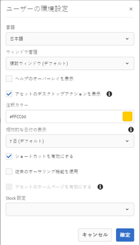

# Use [!DNL Adobe Experience Manager] desktop app {#use-aem-desktop-app-v2}

Use the [!DNL Adobe Experience Manager] desktop app, to easily access the Adobe Experience Manager DAM assets on your local desktop and use these assets in any desktop applications. デスクトップアプリケーションでアセットを開き、アセットをローカルで編集できます。その後、バージョン管理を使用して変更を元の Adobe Experience Manager にアップロードし、更新内容を他のユーザーと共有できます。また、新しいファイルおよびフォルダー階層を Adobe Experience Manager にアップロードしたり、フォルダーを作成したり、Adobe Experience Manager DAM からアセットやフォルダーを削除したりすることもできます。

この統合により、組織内の様々な役割のユーザーがアセットを Adobe Experience Manager Assets で一元管理し、Windows または Mac OS のローカルデスクトップでネイティブアプリケーションからアセットにアクセスできます。

ログアウト後または初めてアプリケーションを開くときに、Adobe Experience Manager サーバーの URL を `https://[aem-server-url]:[port]/` の形式で指定します。次に、「[!UICONTROL Connect]」オプションを選択します。アプリケーションをサーバーに接続するための認証情報を入力します。

Adobe Experience Manager デスクトップアプリケーションを使用しておこなう主なタスクは次のとおりです。

![[!DNL Experience Manager]デスクトップアプリケーションを使用して実行できるワークフローとタスク ](assets/aem_desktop_app_usecases_v2.png "Adobe Experience Manager デスクトップアプリケーションを使用して実行できるワークフローとタスク")
[この](assets/aem_desktop_app_usecases_print.pdf)印刷可能な PDF ファイルをダウンロードします。

## デスクトップアプリケーションの動作の仕組み {#how-app-works2}

アプリケーションの使用を開始する前に、[デスクトップアプリケーションの動作の仕組み](release-notes.md#how-app-works)を理解しておきましょう。また、次の用語についても把握しておいてください。

* **[!UICONTROL Desktop Actions]**：ブラウザーで Assets Web インターフェイスから、アセットの場所を参照したり、アセットをチェックアウトしてネイティブデスクトップアプリケーションで編集用に開くことができます。これらのアクションは Web インターフェイスから実行でき、デスクトップアプリケーションの機能を使用します。詳しくは、[デスクトップアクションを有効にする方法](using.md#desktopactions-v2)を参照してください。

* ファイルのステータスが「**[!UICONTROL Cloud Only]**」：アセットはローカルマシンにはダウンロードされず、Adobe Experience Manager サーバー上でのみ使用可能です。

* ファイルのステータスが「**[!UICONTROL Available locally]**」：アセットはローカルマシンにダウンロードされ、そのまま使用できます。ただし、アセットは変更されません。

* ファイルのステータスが「**[!UICONTROL Edited locally]**」：アセットはローカルに編集され、変更内容は Adobe Experience Manager サーバーにアップロードされた後も保持されます。アップロード後、ステータスは「[!UICONTROL Available locally]」に変わります。詳しくは、[アセットの編集](using.md#edit-assets-upload-updated-assets)を参照してください。

* ファイルのステータスが「**[!UICONTROL Editing conflict]**」：複数のユーザーがアセットを同時に編集した場合は、編集上の競合が発生したことをデスクトップアプリケーションが知らせます。また、変更内容を保持するか破棄するかの選択肢も提示されます。詳しくは、[編集上の競合の回避方法](using.md#adv-workflow-collaborate-avoid-conflicts)を参照してください。

* ファイルのステータスが「**[!UICONTROL Modified remotely]**」：ダウンロードしたアセットが Adobe Experience Manager サーバー上で変更されたことをデスクトップアプリケーションが知らせます。また、最新バージョンをダウンロードするか、ローカルコピーを更新するかの選択肢も提示されます。詳しくは、[編集上の競合の回避方法](using.md#adv-workflow-collaborate-avoid-conflicts)を参照してください。

* **[!UICONTROL Check-out]**：ファイルを編集しようとしている場合やファイルを編集する予定である場合は、ステータスをチェックアウトに切り替えます。アプリケーションおよびExperience ManagerのWebインターフェイスのアセットに錠前のアイコンが追加されます。 ロックアイコンは、編集上の競合が発生するので同じアセットを同時に編集しないように他のユーザーに指示する働きをします。

* **[!UICONTROL Check-in]**：編集上の競合が発生することなく他のユーザーが安全にアセットを編集できることを知らせます。変更内容をアップロードすると、ロックアイコンは自動的に削除されます。チェックインステータスに切り替えた場合も、ロックアイコンが削除されますが、変更内容をアップロードせずに手動でチェックインすることは避けた方がよいでしょう。変更内容を破棄した場合は、手動でチェックインに切り替えます。

* 「**[!UICONTROL Open]**」アクション：アセットを開いて、ネイティブアプリケーションでプレビューするだけです。このアクションではアセットはチェックアウトされず、他のユーザーが編集をおこなえるので、編集上の競合が発生する可能性があります。そのため、このアクションを使用してアセットを編集することはお勧めしません。

* 「**[!UICONTROL Edit]**」アクション：アセットを編集できます。「[!UICONTROL Edit]」アクションをクリックすると、アセットが自動的にチェックアウトされ、アセットにロックアイコンが表示されます。このアクションをクリックした後、アセットを編集しない場合は、「[!UICONTROL Toggle check-in]」をクリックします。Experience ManagerDAMフォルダー階層内のアセットを削除、名前変更または移動するには、編集アクションではなく、Experience ManagerWebインターフェイスアクションを使用します。

* 「**[!UICONTROL Download]**」アクション：アセットをローカルマシンにダウンロードします。アセットをすぐにダウンロードし、後で編集できます。オフラインで作業し、後で変更内容をアップロードすることができます。アセットは、ファイルシステム上のキャッシュフォルダーにダウンロードされます。

* 「**[!UICONTROL Reveal File]**」または「**[!UICONTROL Reveal Folder]**」アクション：アセットがローカルキャッシュフォルダーにダウンロードされると、デスクトップアプリケーションはローカルネットワークドライブを模倣し、各アセットのローカルパスを提供します。このパスを確認するには、デスクトップアプリケーションで適切な表示オプションを使用します。Creative Cloud アプリケーションにアセットを配置するには、このアクションが必要です。詳しくは、[アセットの配置](using.md#place-assets-in-native-documents)を参照してください。

* **[!UICONTROL Open In Web]** action:アセットをExperience ManagerWebインターフェイスで表示するには、Webで開きます。 メタデータの更新やアセットの検出など、Experience Managerインターフェイスからさらに多くのワークフローを開始できます。

* **[!UICONTROL Delete]** action:Experience ManagerDAMリポジトリからアセットを削除します。 この操作により、Experience Managerサーバー上のアセットの元のコピーが削除されます。 ローカルアセットに対する変更だけを破棄する場合は、[変更の破棄](using.md#edit-assets-upload-updated-assets)を参照してください。

* **[!UICONTROL Upload Changes]**:デスクトップアプリは、Experience Managerサーバーに明示的にアップロードする場合にのみ、更新されたアセットをアップロードします。 編集内容を保存しても、変更内容はローカルマシンにのみ保存されます。アップロードすると、アセットは自動的にチェックインされ、ロックアイコンが削除されます。詳しくは、[アセットの編集](using.md#edit-assets-upload-updated-assets)を参照してください。

## Enable desktop actions in Experience Manager web interface {#desktopactions-v2}

ブラウザーの Assets ユーザーインターフェイスから、アセットの場所を参照したり、アセットをチェックアウトしてデスクトップアプリケーションで編集用に開くことができます。これらのオプションは「[!UICONTROL Desktop Actions]」と呼ばれ、デフォルトでは有効になっていません。有効にするには、次の手順に従います。

1. Assets コンソールで、ツールバーの「**[!UICONTROL User]**」アイコンをクリックまたはタップします。
1. 「**[!UICONTROL My Preferences]**」をクリックまたはタップして、**[!UICONTROL Preferences]**&#x200B;ダイアログを表示します。
1. ユーザーの環境設定ダイアログで、「**[!UICONTROL Show Desktop Actions For Assets]**」を選択します。「**[!UICONTROL Accept]**」をクリックまたはタップします。

   

   「[!UICONTROL Show Desktop Actions For Assets]」をオンにすると、デスクトップアクションが有効になります。

## アセットの参照、検索、プレビュー {#browse-search-preview-assets}

Experience Managerリポジトリで使用可能なアセットを参照、検索、プレビューできます。すべてデスクトップアプリケーション内で実行できます。 それには、デスクトップアプリケーションで以下をおこないます。

1. フォルダーを参照し、そのフォルダー内で使用可能なアセットの基本情報と、すべてのアセットの小さなサムネールを確認します。

   

1. 個々のアセットの詳細情報と大きいサムネールを表示するには、ファイル名をクリックします。

   

1. 「**[!UICONTROL Open]**」または「**[!UICONTROL Edit]**」をクリックすると、ファイルがローカルにダウンロードされ、それぞれネイティブアプリケーションでファイルを表示または編集することができます。
1. キーワードを使用して検索を行い、Experience Managerリポジトリ内の関連アセットを検索します。 `?` や `*` をワイルドカードとして使用します。これらのワイルドカードは、それぞれ 1 文字または複数文字に置き換えられます。必要に応じて、検索結果をフィルタリングしたり並べ替えたりします。

   

   

>[!NOTE]
>
>デスクトップアプリケーションは、アセットのタイトルやファイル名だけでなく、複数のメタデータフィールドを検索条件と照合してアセットを表示します。

## アセットのダウンロード {#download-assets}

アセットはローカルファイルシステムにダウンロードできます。アプリケーションは、Experience Managerサーバーからアセットを取得し、同じコピーをローカルファイルシステムに保存します。

アイコンをクリックし、アイコンをクリックしてダウンロードします。

>[!NOTE]
>
>大きなファイルまたは多数のファイルをダウンロードまたはアップロードするときは、アセットやフォルダーに対するアクションが無効になります。これらのアクションは、ダウンロードまたはアップロードが完了すると使用可能になります。

キューのサイズが大きい場合や、ネットワークに問題が発生した場合は、複数のアセットをダウンロードするとパフォーマンスが低下する可能性があります。また、フォルダーのダウンロード時には、知らないうちに、ダウンロードするアセットを多数キューに入れてしまう場合もあります。待ち時間が長くならないようにするために、1 回の操作でダウンロードされるアセットの数が制限されています。その設定方法については、[環境設定の指定](install-upgrade.md#set-preferences)を参照してください。この制限を下回っていても、明らかに大きなフォルダーをダウンロードする場合は、その前に確認が求められることがあります。

フォルダを選択してダウンロードすると、Experience Manager内のフォルダに直接保存されているアセットのみがダウンロードされます。 サブフォルダー内のアセットが自動的にダウンロードされることはありません。

## デスクトップでアセットを開く {#openondesktop-v2}

リモートアセットを開いて、ネイティブアプリケーションで表示することができます。アセットがローカルフォルダーにダウンロードされ、アセットのファイル形式に関連付けられているネイティブアプリケーションで起動されます。ネイティブアプリケーションを変更して、Mac または Windows で特定のファイルタイプ（拡張子）のアセットを開くことができます。

アセットメニューから「**[!UICONTROL Open]**」を選択します。アセットがローカルにダウンロードされ、ネイティブアプリケーションで開かれます。大きなアセットの場合は、ステータスバーでダウンロードの進行状況と転送速度を確認します。

<!-- 
-->

>[!NOTE]
>
>期待した変更がデスクトップアプリケーションに反映されない場合は、更新アイコンをクリックするか、デスクトップアプリケーションインターフェイスで右クリックし「**[!UICONTROL Refresh]**」を選択します。大量のダウンロードまたはアップロードが進行中の間、これらのアクションは使用できません。

アセットのローカルダウンロードフォルダーを開くには、アイコンをクリックし、「 **[!UICONTROL Reveal File]**」アクションをクリックします。

## ネイティブドキュメントへのアセットの配置 {#place-assets-in-native-documents}

ネイティブドキュメントにアセットを配置する場合は、Windows エクスプローラーまたは Mac Finder でファイルにアクセスします。ローカルにダウンロードしたファイルのファイルシステム上の場所に移動するには、「**[!UICONTROL Reveal File]**」オプションを使用します。

事前にローカルマシン上でファイルまたはフォルダーを選択して、「**[!UICONTROL Reveal File]**」または「**[!UICONTROL Reveal Folder]**」（フォルダーの場合）をクリックすると、Windows エクスプローラーまたは Mac Finder が開き、選択したファイルまたはフォルダーが表示されます。このオプションは、ローカルファイルの配置やリンクをサポートするネイティブアプリケーションにExperience Managerファイルを配置する場合などに役立ちます。 Adobe InDesign にファイルを配置する方法については、[グラフィックの配置](https://helpx.adobe.com/jp/indesign/using/placing-graphics.html)を参照してください。

「**[!UICONTROL Reveal File]**」アクションを実行すると、ローカルネットワーク共有が開き、ローカルで使用可能なアセットのみ表示されます。つまり、デスクトップアプリケーションを使用して表示、ダウンロードまたは開いて編集したアセットが表示されます。ローカルネットワーク共有は、変更をExperience Managerにアップロードしません。 変更内容をアップロードするには、デスクトップアプリケーションで明示的に「**[!UICONTROL Upload Changes]**」または「**[!UICONTROL Upload]**」アクションを使用します。

>[!NOTE]
>
>Experience Managerのデスクトップアプリケーションv1.xとの下位互換性を確保するため、表示されるファイルはローカルネットワーク共有から提供され、ローカルで使用できるファイルのみが公開されます。 表示されるファイルのデスクトップパスは、デスクトップアプリケーション v1.x で作成されたパスと同じです。

>[!CAUTION]
>
>「**[!UICONTROL Reveal File]**」オプションを使用してネイティブアプリケーションでアセットを編集しないでください。代わりに、「**[!UICONTROL Edit]**」アクションを使用します。詳しくは、[高度なワークフロー：同じファイルに対する共同作業と編集上の競合の回避](#adv-workflow-collaborate-avoid-conflicts)を参照してください。

## Edit assets and upload updated assets to Experience Manager {#edit-assets-upload-updated-assets}

変更を加える際に、編集用にアセットを開き、更新したアセットをExperience Manager EMサーバーにアップロードします。 他のユーザーの編集内容と競合しないように、デスクトップアプリケーションを使用して編集セッションを開始します。編集を開始する前に、アセットにロックアイコンが付いていないこと、つまり別のユーザーがアセットを編集していないことを確認します。

アセットを編集するには、該当するアセットを検索するか、アセットの場所を参照します。アイコンをクリックし、「**[!UICONTROL Edit]**」をクリックします。

次のどちらの状況でも、他のユーザーの編集と競合しないように、「**[!UICONTROL Toggle Check-out]**」を使用してアセットをロックします。

* 先にアセットをチェックアウトせずに（例えば単に開いて）アセットの編集を開始した。
* アセットの編集をすぐに開始するつもりであり、他のユーザーには編集されないようにしたい。

編集が完了すると、変更したアセットのステータスが「**[!UICONTROL Edited Locally]**」としてデスクトップアプリケーションに表示されます。アセットに保存された変更はすべて、Experience Managerにアップロードするまで、ローカルのみに反映されます。 個々のアセットまたは複数のアセットを 1 つずつアップロードするには、アセットのオプションから「**[!UICONTROL Upload Changes]**」をクリックします。Experience Manager内にアセットのバージョンが作成されます。 Using the web interface of [!DNL Assets], you can see asset history in the [Timeline view](https://experienceleague.adobe.com/docs/experience-manager-65/assets/using/activity-stream.html?lang=ja).

共同編集に関するベストプラクティスについては、[高度なワークフロー：同じファイルに対する共同作業と編集上の競合の回避](#adv-workflow-collaborate-avoid-conflicts)を参照してください。

次の場合は、ローカルアセットに対する変更や編集を破棄することができます。「**[!UICONTROL Discard Changes]**」をクリックします。

* ローカルの変更をExperience Managerに保存しない場合。
* 変更内容を保存した後、元のアセットに対する変更を開始した場合。
* 必要なくなったのでアセットの編集を停止した場合。

必要に応じて、チェックアウトを切り替えます。更新されたアセットがローカルキャッシュフォルダーから削除され、編集時または開く際に再度ダウンロードされます。

## Upload and add new assets to Experience Manager {#upload-and-add-new-assets-to-aem}

ユーザーは、DAM リポジトリに新しいアセットを追加できます。例えば、代理店の写真家や契約業者で、写真からExperience Managerリポジトリに多数の写真を追加したい場合があります。 To add fresh content to Experience Manager, click  in the top-bar of the app. ローカルファイルシステム内のアセットファイルを参照し、「**[!UICONTROL Select]**」をクリックします。アセットのアップロードが開始され、アップロードに時間がかかる場合は、デスクトップアプリケーションの下部に進行状況バーが表示されます。フォルダーの作成やアップロード時には、空白や無効な文字を使用しないでください。See a list of characters at [Create folders in [!DNL Assets]](https://experienceleague.adobe.com/docs/experience-manager-65/assets/managing/manage-assets.html?lang=ja#creating-folders).

<!-- 
-->

ローカルファイルシステムからフォルダーや個々のファイルをアップロードできます。フォルダーの階層はアップロード時に保持されます。アセットを一括でアップロードする場合は、まず[一括アップロード](#bulk-upload-assets)を参照してください。

特定のセッションで転送されたアセットのリストを表示するには、**[!UICONTROL View]**／**[!UICONTROL Assets transfers]**&#x200B;を選択します。このリストを見れば、現在のセッションのファイル転送をざっと確認できます。

**[!UICONTROL Preferences]**／**[!UICONTROL Upload acceleration]**&#x200B;の設定で、アップロードの同時実行性（高速化）を制御できます。通常は、同時実行性が高いほど、アップロードが高速になりますが、その反面、リソースの消費が大きくなり、ローカルマシンで消費される処理能力が増える可能性があります。システムの処理速度が低下した場合は、同時実行性の設定値を低くして、アップロードを再度試みます。

>[!NOTE]
>
>転送リストは永続的なものではなく、デスクトップアプリケーションを終了して再度開いた場合は使用できません。

>[!NOTE]
>
>If the files fail to upload and if you are connecting to Experience Manager 6.5.1 or later deployment, see this [troubleshooting information](troubleshoot.md#upload-fails).

## 複数アセットの操作 {#work-with-multiple-assets}

ユーザーは、1 回の操作ですべての編集内容をアップロードしたり、ネストしたフォルダーを数回のクリックでアップロードするといったアクションを使用して、複数のアセットを容易に操作および管理することができます。

### 大きいフォルダーの参照 {#browse-large-folders}

多数のアセットを含んだフォルダーを操作する場合は、スクロールしてさらにアセットを表示します。キーボードを使用してスクロールするには、Tab キーを数回押して、上部のアセットを選択します。選択されたアセットが強調表示されます。次に、下向き矢印キーを使用して、アセットのリスト内を移動します。

### 選択したアセットに対するクイックアクション {#quick-actions-for-selected-assets}

いくつかのアセットのサムネールをクリックすると、それらのアセットを選択できます。すべてのアセットを選択するには、デスクトップアプリケーションの上部バーにあるチェックボックスをクリックします。選択したすべてのアセットに対して一括で適用できる一連のアクションが、デスクトップアプリケーションの下部にあるツールバーに表示されます。

下部のツールバーで使用できるアクションは、選択したファイルのステータスによって異なります。例えば、「**[!UICONTROL Edited Locally]**」ステータスのファイルだけを選択した場合は、「**[!UICONTROL Upload Changes]**」アイコンが表示されます。「**[!UICONTROL Edited locally]**」ステータスと「**[!UICONTROL Cloud only]**」ステータスのファイルを同時に選択した場合、「**[!UICONTROL Upload Changes]**」アクションは使用できません。

### 編集したすべての画像の検索 {#find-all-edited-images}

デスクトップアプリケーションには、「**[!UICONTROL Edited locally]**」というビューが用意されており、（「[!UICONTROL Open]」または「[!UICONTROL Edit]」アクションを使用して）ローカルにダウンロードしてから変更したすべてのファイルにすばやくアクセスできます。デスクトップアプリケーションでは、ローカルで編集したすべてのアセットを選択し、数回のクリックで変更内容をアップロードできます。このビューには、編集上の競合がある、ローカルで編集したアセットも表示されます。

### アセットの一括アップロード {#bulk-upload-assets}

写真家やクリエイティブエージェンシーなどのユーザーや組織は、撮影、レタッチ、Experience Manager外で行った大きなセットからの選択など、シナリオで多数のローカルアセットを作成できます。 They can upload these large local folders to [!DNL Assets] directly from the desktop app. フォルダー階層が保持され、ネストしたサブフォルダーとその中に含まれているアセットがすべてアップロードされます。アップロードしたアセットは、同じサーバーの他のユーザーからもすぐに利用できます。アセットはバックグラウンドでアップロードされるので、操作が Web ブラウザーセッションに縛られることはありません。

アップロード後に、期待した変更がデスクトップアプリケーションに反映されない場合は、更新アイコンをクリックします。

>[!NOTE]
>
>2つのExperience Managerデプロイメント間でアセットを移行する場合は、アップロード機能を使用しないでください。 その代わり、[移行ガイド](https://experienceleague.adobe.com/docs/experience-manager-65/assets/administer/assets-migration-guide.html?lang=ja)を参照してください。

### 転送したアセットのリスト {#list-of-transferred-assets}

To view the list of assets transferred in a given session, see [Upload assets to Experience Manager](#upload-and-add-new-assets-to-aem).

## Advanced workflow: start from the [!DNL Assets] web interface {#adv-workflow-start-from-aem-ui}

必要に応じて、 Assets Web インターフェイスからワークフローを開始します。デスクトップアプリは、Experience Managerと統合され、Desktop Actionsを使用して要求されたときに引き継がれます。

Web インターフェイスからワークフローを開始する特殊なケースに、アセット検出があります。Assets ユーザーインターフェイスのオムニサーチバーを利用すると、各種の高度な検索を実行できます。まず Web 上で目的のアセットを探してから、「[!UICONTROL Desktop Actions]」を使用してデスクトップアプリケーションでワークフローを開始することができます。例えば、ファセットを使用した検索結果のフィルタリング、Adobe Stock からライセンスを取得した特定アセットの検索、Web インターフェイスからの検出を強化できるカスタマイズの組織的実装などがあります。

Assets Web インターフェイスで以下のアクションを実行しようとすると、デスクトップアプリケーション機能が使用されます。

* 「[!UICONTROL Open]」、「[!UICONTROL Edit]」、「[!UICONTROL Reveal]」が実行可能な「[!UICONTROL Desktop Actions]」
* [!UICONTROL Upload folder]
* 「[!UICONTROL Check-out]」または「[!UICONTROL check-in]」

例えば、デスクトップアプリケーションでチェックアウトされたアセットに対して Web インターフェイス上で使用できるアクションは、「[!UICONTROL Open]」、「[!UICONTROL Reveal]」、「[!UICONTROL Check-in]」です。

>[!NOTE]
>
>Adobe Experience Manager デスクトップアプリケーションの起動の許可を求めるメッセージがブラウザーに表示される場合があります。ブラウザーからデスクトップアプリケーションに中断のない転送をおこなうには、該当するチェックボックスをオンにして、常にデスクトップアプリケーションが処理を引き継げるようにします。

Web インターフェイスを使用しても、以下の情報やワークフローは見つかりません。Web インターフェイスではローカルの変更を追跡せず、以下を認識できないので、デスクトップアプリケーションを使用します。

* ローカルで編集されたファイル
* 編集上の競合とその解決方法があるファイル
* ローカルでの変更をExperience Managerにアップロードします。
* ローカルで使用できるファイルの様々なステータス

むしろ、「**[!UICONTROL Open In Web]**」アクションを使用して、デスクトップアプリケーションから Web インターフェイスを起動し、そこにアセットを開くことができます。

## 高度なワークフロー：同じファイルに対する共同作業と編集上の競合の回避 {#adv-workflow-collaborate-avoid-conflicts}

共同作業環境では、複数のユーザーが同じアセットセットを操作して、バージョンの競合を引き起こすおそれがあります。競合を防ぐには、以下のベストプラクティスに従います。

* 「[!UICONTROL Open]」をクリックしてアセットを編集しない。ローカルにダウンロードしたアセットをファイルシステムフォルダーから開いて編集しないでください。他のユーザーは、そのアセットが編集中であることがわかりません。
* アセットを編集する場合は、必ず「[!UICONTROL Edit]」をクリックする。これにより、ネイティブアプリケーションでアセットが開かれ、アセットにロックアイコンが表示されます。その結果、アセットが編集中であることが他のユーザーにわかります。
* 「[!UICONTROL Toggle Check-in]」をクリックせずに誤って編集を開始した場合は、「[!UICONTROL Edit]」をクリックする。これにより、アセットにロックアイコンが表示されます。後でアセットを編集する予定であっても、他のユーザーによる編集を避けたい場合は、「[!UICONTROL Toggle Check-in]」をクリックしてアセットをロックします。
* アセットを編集する前に、そのアセットを他のユーザーが編集していないことを確認する。アセットにロックアイコンが表示されていないかを確認します。
* 編集が完了したら、変更内容をすべてアップロードしてから、アセットをチェックインする。

If a locally downloaded asset is updated on the Experience Manager server, the app displays a **[!UICONTROL Modified remotely]** status. 「[!UICONTROL Remove]」か「[!UICONTROL Update]」をクリックして、ローカルコピーを削除するか更新することができます。ダイアログ上のリンクを使用すると、アセットのどちらのバージョンも表示できます。

ローカルで編集中のアセットが、知らないうちにサーバー上でも更新されると、デスクトップアプリケーションに「**[!UICONTROL Editing Conflict]**」ステータスが表示されます。どちらか一方の変更セットを保持できます。つまり、自分の更新内容を保持して他のユーザーの編集内容を削除する（「**[!UICONTROL Keep Mine]**」をクリック）か、他のユーザーの更新内容を尊重して自分の編集内容を削除します（「**[!UICONTROL Overwrite Mine]**」をクリック）。

## 高度なワークフロー：InDesign ファイルへのアセットの配置とリンク {#adv-workflow-place-assets-indesign}

Experience Managerデスクトップアプリを使用して、リンクされたアセットが含まれるファイルを開くと、アセットは事前にダウンロードされ、ネイティブアプリケーションに配置されて表示されます。 このワークフローを機能させるには、ネイティブアプリケーションでローカルアセットへのリンクの配置がサポートされている必要があり、Experience Managerでは、これらのリンクをサーバー側参照に対するバイナリファイルで解決できる必要があります。

Experience Managerのデスクトップアプリケーションは、Adobe InDesign、Adobe Illustrator、Adobe Photoshopなど、Adobe Creative Cloudの一部のデスクトップアプリケーションとファイル形式で、このワークフローをサポートしています。 このワークフローを使用すると、サポートされている Creative Cloud ファイルを効率的に操作できます。したがって、ユーザAがInDesignファイルにいくつかのアセットを配置し、それをExperience Managerにチェックインすると、ユーザBは、そのアセットがファイルの一部ではないにもかかわらず、InDesignファイル内のアセットを確認します。 このアセットは、ユーザー B のマシンにローカルでダウンロードされます。

>[!NOTE]
>
>デスクトップアプリケーションでは、Windows 上の任意のドライブにマッピングできます。ただし、操作をスムーズにおこなうには、デフォルトのドライブ文字を変更しないでください。同じ組織のユーザーが異なるドライブ文字を使用している場合、他のユーザーが配置したアセットは表示されません。パスが変更されると、配置されたアセットは取得されません。配置されたアセットは、バイナリファイル（INDD など）に配置されたままで、削除されません。

このワークフローの制限事項については、[必要システム構成とサポート対象バージョン](release-notes.md#system-requirements-and-prerequisites-v2)を参照してください。

画像アセットと InDesign でこのワークフローを試すには、以下の手順に従います。

1. INDDファイルを保存し、アセットをExperience Managerに配置しておきます。 このような INDD ファイルの作成方法については、[グラフィックの配置](https://helpx.adobe.com/jp/indesign/using/placing-graphics.html)を参照してください。
1. From within desktop app, **[!UICONTROL Edit]** the INDD file with placed assets in Experience Manager.
1. デスクトップアプリケーションが、InDesign ファイルおよびリンクされたアセットを両方ともダウンロードします。ドキュメントが InDesign で開かれると、リンクが解決され、アセットがダウンロードされて InDesign ドキュメントに表示されます。
1. InDesign ファイルに新しいグラフィックを配置するには、アセットに対して「**[!UICONTROL Reveal File]**」アクションを使用します。このアクションにより、アセットがローカルにダウンロードされ、ローカルネットワーク共有の場所が Windows エクスプローラーまたは Mac Finder で開かれます。
1. 表示されたアセットを InDesign ドキュメントに配置します。これで、ドキュメントにリンクが作成されます。
1. InDesignドキュメントでの編集が完了したら、保存し、デスクトップアプリを使用してExperience Managerにアップロードします。

## 高度なワークフロー：アセットのローカルダウンロード {#adv-workflow-download-assets-locally}

多くのシナリオで、Experience Managerサーバーからローカルのファイルシステム上にアセットがダウンロードされます。 ダウンロードすると、帯域幅とディスク容量を消費します。状況を把握することで、ダウンロードが完了するまでの待ち時間を最適化できます。

デスクトップアプリケーション内からアセットをオンデマンドでダウンロードします。詳しくは、[アセットのダウンロード](#download-assets)を参照してください。

「[!UICONTROL Open]」アクションを使用してネイティブデスクトップアプリケーションでアセットを開くと、そのアセットがまだローカルで使用できない場合は、ローカルにダウンロードされます。詳しくは、[アセットを開く](#openondesktop-v2)を参照してください。

デスクトップアプリケーション内からアセットまたはフォルダーの場所を表示すると、そのアセットまたはフォルダーはまずローカルにダウンロードされてから、ユーザーのコンピューター上のローカルネットワーク共有内で開かれます。詳しくは、[アセットを開く](#openondesktop-v2)を参照してください。

「[!UICONTROL Edit]」アクションを使用してネイティブデスクトップアプリケーションでアセットを編集すると、そのアセットがまだローカルで使用できない場合は、ローカルにダウンロードされます。See [Edit assets and upload updated assets to Experience Manager](#edit-assets-upload-updated-assets).

If the app is installed and permitted to, it completes the actions when you use [!UICONTROL Desktop Actions] from Experience Manager web interface. デスクトップアプリケーションはまずアセットをダウンロードしてから、アクションを実行します。
