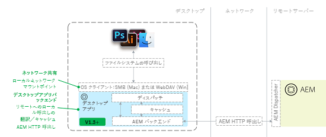

# [!DNL Adobe Experience Manager] デスクトップアプリケーション v1.x のトラブルシューティング {#troubleshoot-aem-desktop-app}

AEM デスクトップアプリケーションのインストール、アップグレード、設定などで発生することのある問題のトラブルシューティングについて説明します。

[!DNL Adobe Experience Manager] デスクトップアプリケーションには、AEM Assets リポジトリーをデスクトップのネットワーク共有（Mac OS では SMB 共有）としてマッピングするのに役立つユーティリティが含まれています。ネットワーク共有とは、リモートソースをコンピューターのローカルファイルシステムの一部であるかのように扱うオペレーティングシステム（OS）テクノロジーです。デスクトップアプリケーションの場合は、リモート AEM インスタンスのデジタルアセット管理（DAM）リポジトリー構造をリモートファイルソースとして利用します。デスクトップアプリケーションのトポロジを次の図に示します。



このアーキテクチャでは、デスクトップアプリケーションはマウントされたネットワーク共有に対するファイルシステムコール（open、close、read、write など）を受け取り、それらを AEM サーバーへのネイティブな AEM HTTP 呼び出しに変換します。ファイルはローカルにキャッシュされます。詳しくは、[AEM デスクトップアプリケーション v1.x の使用](use-app-v1.md)を参照してください。

## AEM デスクトップアプリケーションコンポーネントの概要 {#desktop-app-component-overview}

デスクトップアプリケーションには、以下のコンポーネントが含まれています。

* **デスクトップアプリケーション**：DAM をリモートファイルシステムとしてマウント／アンマウントし、ローカルにマウントされたネットワーク共有と、接続先のリモート AEM インスタンスとの間のファイルシステムコールを変換します。
* **オペレーティングシステムの WebDAV／SMB クライアント**：Windows エクスプローラー／Finder とデスクトップアプリケーションとのやり取りを処理します。ファイルの取得、作成、変更、削除、移動またはコピーがおこなわれた場合は、オペレーティングシステム（OS）の WebDAV／SMB クライアントがこの操作をデスクトップアプリケーションに伝えます。操作を受け取ると、デスクトップアプリケーションはそれをネイティブな AEM リモート API 呼び出しに変換します。例えば、ユーザーがマウントされたディレクトリ内でファイルを作成する場合は、WebDAV／SMB クライアントがリクエストを開始します。デスクトップアプリケーションはこのリクエストを、DAM 内でファイルを作成するための HTTP リクエストに変換します。WebDAV／SMB クライアントは OS に組み込まれたコンポーネントであり、デスクトップアプリケーション、AEM またはアドビとはいかなる関係もありません。
* **Adobe Experience Manager インスタンス**：AEM Assets DAM リポジトリーに保存されたアセットへのアクセスを提供します。さらに、ローカルのデスクトップアプリケーションに代わってデスクトップアプリケーションからリクエストされたアクションを実行し、マウントされたネットワーク共有とのやり取りをおこないます。ターゲットAEMインスタンスは、AEMバージョン 6.1 以降を実行する必要があります。 以前のバージョンのAEMを実行するAEMインスタンスで完全に機能するには、追加の機能パックとホットフィックスがインストールされている必要が生じる場合があります。

## AEM デスクトップアプリケーションの想定される使用例 {#intended-use-cases-for-aem-desktop-app}

AEM デスクトップアプリケーションはネットワーク共有テクノロジーを使用して、リモート AEM リポジトリーをローカルデスクトップにマッピングします。ただし、ユーザーがローカルデスクトップから直接デジタルアセット管理操作を実行する、アセットを保持するネットワーク共有の代わりとなるものではありません。 例えば、複数のファイルの移動やコピー、大きなフォルダー構造のAEM Assetsネットワーク共有へのドラッグを Finder/エクスプローラーで直接おこなう場合などです。

AEM デスクトップアプリケーションは、AEM Assets のタッチ操作対応 UI とローカルデスクトップの間をつなぎ、DAM アセットのアクセス（オープン）と編集（保存）を手軽におこなえるようにする手段となります。これにより、AEM Assets サーバー内のアセットとデスクトップベースのワークフローがリンクされます。

以下に、AEM デスクトップアプリケーションのサンプルの使用例を示します。

* ユーザーがAEMにログインし、Web UI を使用してアセットを検索します。
* ユーザーは、AEM Web UI のデスクトップアクション機能を使用して、必要に応じて、デスクトップ上でアセットを開く、表示する、または編集します。
* AEM デスクトップアプリケーションはそのアセットをアセットのファイルタイプに応じたデフォルトのエディターで開きます。
* ユーザーがアセットに対して必要な変更を加えます。
* ファイルを変更した後、ユーザーは AEM デスクトップアプリケーションのバックグラウンド同期ステータスウィンドウを使用して、ファイルの同期ステータスを表示できます。
* ユーザーは、AEM デスクトップアプリケーションのコンテキストメニューを使用して、アセットをチェックイン／チェックアウトするか、DAM ユーザーインターフェイスに戻ります。
* ファイルに対する変更が完了すると、ユーザーはAEM Web UI に戻ります

これが唯一の使用例ではありません。 この例から、AEM デスクトップアプリケーションがアセットのアクセスと編集をローカルで実行する便利な手段であることがわかります。DAM Web UI の方がエクスペリエンスが向上するので、できる限り使用することをお勧めします。 Adobeは、お客様の要件に応える柔軟性を高めます。

## 制限事項 {#limitations}

WebDAV／SMB1 ネットワーク共有は、ファイルをエクスプローラー／Finder ウィンドウ内で操作するための便利な方法です。ただし、ネットワーク接続を介してエクスプローラー／Finder と AEM の間でやり取りする際には、一定の制限があります。例えば、1 GB のファイルをマウントされた WebDAV／SMB ディレクトリにコピーするのにかかる時間は、1 GB のファイルを Web ブラウザーを使用して Web サイトにアップロードするのに必要な時間とほぼ同じです。実際のところ、前者の処理については、WebDAV／SMB プロトコルや OS の WebDAV／SMB クライアントの非効率性のために、もっと時間がかかることがあります（特に Mac OS X の場合）。

マウントされたディレクトリで実行できる作業の種類には制限があります。一般的に、大きなファイルの取り扱いは困難です。特に、低速／高レイテンシ／低帯域幅のネットワーク接続を使用する場合や、大きなファイルを編集する場合には支障があります。

マウントされたディレクトリからその場で特定のファイルタイプを効率的に編集できると顧客に約束する前に、そのシナリオに沿ったテストを実施することをお勧めします。

AEM デスクトップアプリケーションは、以下のような大量の I/O を伴うファイルシステムの操作（これらに限りません）には適していません。

* ファイルとディレクトリの移動またはコピー
* AEMへの多数のアセットの追加
* ファイル・システム内でのファイルの検索と開く（フォルダの参照を除く）
* ファイルアーカイブの圧縮または解凍

オペレーティングシステムの制限により、Windows ではファイルサイズの上限が 4,294,967,295 バイト（約 4.29 GB）と定められています。この制限は、ネットワーク共有上のファイルサイズの上限を定めるレジストリ設定に由来します。このレジストリ設定は DWORD 値であり、DWORD 値の上限が前述の数値になっています。

[!DNL Experience Manager] デスクトップアプリケーションには、一定時間の経過後に [!DNL Experience Manager] サーバーとデスクトップアプリケーションの間の接続を切断するための設定可能なタイムアウト値がありません。サイズの大きいアセットをアップロードする際に、しばらくして接続がタイムアウトした場合、アプリケーションはアップロードタイムアウトを長くして、アセットのアップロードを数回再試行します。デフォルトのタイムアウト設定を変更するお勧めの方法はありません。

## キャッシュと AEM との通信 {#caching-and-communication-with-aem}

AEM デスクトップアプリケーションは、使い勝手を向上させるために、内部キャッシュとバックグラウンドアップロード機能を備えています。大きなファイルを保存すると、作業を続行できるよう、まずローカルに保存されます。 しばらくして（現在は 30 秒）、ファイルがバックグラウンドでAEMサーバーに送信されます。

Creative Cloud デスクトップアプリケーションやその他のファイル同期ソリューション（Microsoft One Drive など）とは異なり、AEM デスクトップアプリケーションは完全なデスクトップ同期クライアントではありません。なぜなら、AEM デスクトップアプリケーションは AEM Assets リポジトリー全体へのアクセスを提供しますが、このリポジトリーはときに数百 GB から数 TB に及び、完全に同期するには大きすぎる場合があるからです。

キャッシュは、ネットワークやストレージのオーバーヘッドを制限し、ユーザーに関連のあるアセットのサブセットのみを扱うための機能です。

>[!CAUTION]
>
>ブラウズを高速化するために、サムネールの生成をオフにすることをお勧めします。アイコンプレビューを有効にした場合、マウントされたフォルダー内を移動すると、アプリケーションはデジタルアセットをキャッシュします。また、ユーザーにとって重要でない可能性のあるアセットもダウンロードされるので、サーバーに負荷がかかり、ユーザーの帯域幅が消費され、使用されるユーザーのディスク領域も増えます。

AEM デスクトップアプリケーションにおけるキャッシュの仕組みは以下のとおりです。

* ユーザーが Finder 内でフォルダーを開いてファイルのサムネール／プレビューを表示したり、アプリケーション内でファイルを開いたりすると、デスクトップアプリケーションはそのファイルバイナリをキャッシュします。
* Finder や他のデスクトップアプリケーションを使用してファイルを保存する場合、ファイルは最初にローカルに保存（キャッシュ）され、オペレーティングシステムに通知が送信されます。 その後、ファイルはバックグラウンドでサーバーにアップロードするためのキューに登録され、最終的にはネットワークを介してアップロードされます。 ネットワークエラーが発生した場合、デスクトップアプリケーションはファイル全体のアップロードを最大 3 回再試行します。3 回再試行してもアップロードできない場合、ファイルは競合ファイルとしてマークされ、バックグラウンドアップロードキューのステータスウィンドウにステータスが表示されます。デスクトップアプリケーションは、その後はファイルの更新を試みません。接続が復元されたら、ファイルを更新し、再度アップロードする必要があります

すべての操作がローカルにキャッシュされるわけではありません。 次の情報は、ローカルキャッシュなしでAEM Server に即座に送信されます。

* フォルダーに対する操作（作成、削除など）
* バージョン 1.4 で導入されたフォルダーアップロード機能を使用すると、ファイルをローカルにキャッシュすることなく、ローカルフォルダー階層をアップロードできます

## 個別の操作 {#individual-operations}

個別のユーザーについてパフォーマンス関連のトラブルシューティングをおこなう際は、まず[アプリの制限事項](#limitations)を確認してください。以降の節では、個別のユーザーのパフォーマンスを向上させるための推奨事項について説明します。

## 帯域幅の推奨事項 {#bandwidth-recommendations}

個々のユーザーが利用できる帯域幅は、WebDAV/SMB クライアントのパフォーマンスにとって重要な役割を果たします。

Adobeでは、個々のユーザーのアップロード速度を 10 Mbps に近づけることをお勧めします。 ワイヤレス接続の場合、帯域幅は多くの場合、複数のユーザー間で共有されます。 複数のユーザーが同時にネットワーク帯域幅を消費するタスクを実行すると、パフォーマンスがさらに低下する可能性があります。 このような問題を回避するには、有線接続を使用します。

<!-- AG, 8/18: The Windows KB article is removed by MS now. Giving 404. Also, Win 7 support is gone and the desktop app is also not supported on Win 7. Hiding this content for now.

## Windows-specific configurations {#windows-specific-configurations}

If you use Experience Manager on Windows, you can configure Windows to enhance the performance of the WebDAV client. For more information, go to [https://support.microsoft.com/en-us/kb/2445570](https://support.microsoft.com/en-us/kb/2445570).

On Windows 7, modifying IE settings can improve the performance of WebDAV. For details, see how to [fix slow WebDAV performance in Windows 7](https://oddballupdate.com/2009/12/fix-slow-webdav-performance-in-windows-7/).
-->

## 同時操作 {#concurrent-operations}

ユーザーがローカルでファイルを操作するときには、AEM デスクトップアプリケーションは、そのファイルの新しいバージョンが AEM 内にないかを確認します。新しいバージョンが使用可能な場合、アプリケーションはファイルの新しいコピーをローカルキャッシュにダウンロードします。 ただし、AEM Desktop では、ローカルにキャッシュされたファイルが変更されても、上書きされません。 この機能は、誤って作業が上書きされるのを防ぎます。

同じファイルがローカルとAEMの両方で変更されると、ローカルで変更されたバージョンはAEMのバージョンを上書きします。 この場合、以前のバージョンをアセットのタイムラインで使用できます。 両方のバージョンを確認し、競合を解決できます。

ローカルファイルがサーバーで使用可能なバージョンと一致しない場合、バックグラウンドアップロードステータスダイアログに競合についての通知が表示されます。 問題を解決するには、競合するファイルを開き、保存します。 ファイルを保存することで、AEM デスクトップアプリケーションに最新のローカルの変更内容を AEM に同期させることができます。以前のバージョンのアセットをタイムラインに表示して、競合を解決できます。

複数のユーザーが同じAEMインスタンスをターゲットとして、別々にマウントされたディレクトリで作業をしようとする場合は、追加の要因を考慮に入れる必要があります。 特に、次の要因が重要です。

* ユーザーの発信元ネットワークで使用可能な帯域幅の量
* 発信元ネットワークのネットワーク構成（ファイアウォールやプロキシなど）
* ターゲットAEMインスタンスのネットワークで使用可能な帯域幅の量
* Dispatcher がターゲットAEMインスタンスの前に存在するかどうか
* ターゲットAEMインスタンスの現在の読み込み

## 追加のAEM設定 {#additional-aem-configurations}

複数のユーザーが同時に作業するときに WebDAV/SMB のパフォーマンスが大幅に低下する場合は、AEMでいくつかの設定を行うと、パフォーマンスが向上します。

## アセットの一時的なワークフローを更新 {#update-asset-transient-workflows}

DAM アセットの更新ワークフローの一時的なワークフローを有効にすることで、AEM側のパフォーマンスを向上させることができます。 一時的なワークフローを有効にすると、AEMでアセットを作成または変更する際に、アセットの更新に必要な処理能力が低下します。

1. Experience Manager インスタンス（`https://[aem_server]:[port]/miscadmin`）の `/miscadmin` に移動します。
1. ナビゲーションツリーで、**ツール**／**ワークフロー**／**モデル**／**dam** と展開します。
1. ダブルクリック **DAM アセットの更新**.
1. フローティングツールパネルで、 **ページ** タブを押し、 **ページプロパティ**.
1. を選択します。 **一時的なワークフロー** チェックボックスをオンにして、 **OK**.

### Granite 一時ワークフローキューの調整 {#adjust-granite-transient-workflow-queue}

AEM のパフォーマンスを向上させるもう 1 つの方法は、「Granite 一時的なワークフローキュー」ジョブについて並列ジョブの最大数を設定することです。推奨される値は、サーバーで利用可能な CPU の数の半分程度です。値を調整するには、以下の手順に従います。

1. 設定する AEM インスタンスの `/system/console/configMgr` に移動します（例：`https://[aem_server]:[port]/system/console/configMgr`）。
1. `QueueConfiguration` を検索し、各ジョブをクリックして開いて「**Granite 一時的なワークフローキュー**」ジョブを探し、「**編集**」をクリックします。
1. `Maximum Parallel Jobs` 値を変更し、「**保存**」をクリックします。

## AWS設定 {#aws-configuration}

複数のユーザーが同時に作業する場合、ネットワーク帯域幅の制限により、WebDAV/SMB のパフォーマンスが低下する可能性があります。 WebDAV/SMB のパフォーマンスを高めるために、AWS上で実行されるターゲットAEMインスタンスに対して、AWSインスタンスのサイズを増やすことをお勧めします。

この測定値は、サーバーが使用できるネットワーク帯域幅の量を大幅に増加させます。 以下に、詳細を示します。

* AWSインスタンスのサイズが大きくなると、1 つのインスタンスに割り当てられるネットワーク帯域幅の量が増えます。 各インスタンスサイズで使用可能な帯域幅について詳しくは、 [AWSドキュメント](https://aws.amazon.com/ec2/instance-types/).
* 大規模なクライアントのトラブルシューティング時に、AdobeはAEMインスタンスのサイズを c4.8xlarge に設定しました（主に、提供する専用帯域幅 4000 Mbps に対して）。
* AEMインスタンスの前に Dispatcher がある場合は、適切なサイズであることを確認します。 AEMインスタンスが 4000 Mbps を提供し、Dispatcher が 500 Mbps しか提供しない場合、有効な帯域幅は 500 Mbps のみです。 これは、Dispatcher がネットワークのボトルネックを生み出すためです。

## チェックアウトしたファイルの制限 {#checked-out-file-limitations}

エクスプローラー/Finder を使用してチェックアウトしたファイルを操作する方法には、いくつかの既知の制限があります。 ファイルがチェックアウトされている場合は、そのファイルをチェックアウトしているユーザー以外のユーザーに対しては読み取り専用です。 AEMでの WebDAV/SMB1 プロトコルの実装では、このルールが適用されます。 しかし、OS WebDAV/SMB クライアントは、チェックアウトされたファイルを適切に操作しない場合が多い。 以下では、いくつかの変更点について説明します。

### 一般 {#general}

チェックアウトしたファイルに書き込むときには、AEM の WebDAV 実装の範囲内においてのみロックが適用されます。その結果、WebDAV を使用するクライアント（デスクトップアプリケーションなど）でのみロックが適用されることになります。AEM の Web インターフェイスを介した場合は、ロックが適用されません。AEMインターフェイスでは、チェックアウトされたアセットのカード表示にロックアイコンが表示されるだけです。 アイコンは化粧用で、AEMの動作には影響しません。

一般に、WebDAV クライアントは必ずしも期待どおりに動作するとは限りません。 その他の問題が発生する場合があります。 ただし、AEMでアセットを更新または確認すると、アセットが変更されていないことを確認するのに適しています。 この動作は、OS WebDAV クライアントの一般的な動作ですが、Adobeの管理下にありません。

### Windows {#windows}

Windows のファイルエクスプローラからファイルが消えるので、ファイルの削除は正常に行われたように見えます。 ただし、ディレクトリを更新してAEM Assets をチェックインすると、ファイルがまだ存在していることが示されます。 また、ファイルの編集が成功したように見えます（警告ダイアログやエラーメッセージは表示されません）。 ただし、ファイルを再度開いたりAEM Assets をチェックインしたりすると、ファイルが変更されていないことがわかります。

#### Mac OS X {#mac-os-x}

ファイルを置き換えても警告やエラーは表示されませんが、AEMでアセットをチェックすると、そのアセットは変更されていないことがわかります。 AEMでアセットを更新または確認して、変更されていないことを確認します。

## デスクトップアプリケーションのアイコンに関する問題のトラブルシューティング（Mac OS X）  {#troubleshooting-desktop-app-icon-issues-mac-os-x}

デスクトップアプリケーションをインストールすると、デスクトップアプリケーションのメニューアイコンがメニューバーに表示されます。アイコンが表示されない場合は、次の手順を実行して問題を解決します。

1. OS ターミナルウィンドウを開きます。
1. コマンドプロンプトで次のコマンドを入力し、Enter キーを押します。

   ```shell
    cd ../Library/Caches.
   ```

1. 次のコマンドを入力し、Enter キーを押します。

   ```shell
   rm -r com.adobe.aem.assetscompanion
   ```

1. 次のコマンドを入力し、Enter キーを押します。

   ```shell
   cd ~/Library/Preferences
   ```

1. 次のコマンドを入力し、Enter キーを押します。

   ```shell
   rm com.adobe.aem.assetscompanion.plist
   ```

1. 次のコマンドを入力し、Enter キーを押します。

   ```shell
   rm ~/Library/Group\ Containers/group.com.adobe.aem.desktop/*
   ```

1. システムを再起動します。

AEM デスクトップアプリケーションは、特定のファイルに対して 3 回同期を試みます。3 回試行してもファイルの同期に失敗する場合、AEM デスクトップアプリケーションはファイルが競合していると見なし、バックグラウンドアップロードのステータスウィンドウに通知が表示されます。競合状態とは、最新の変更内容がローカルに存在しているが、まだ AEM に同期されていないことを示します。それ以降、AEM デスクトップアプリケーションは同期を試みません。

この状況を解決する最も簡単な方法は、競合しているファイルを開き、再度保存することです。保存することで、AEM デスクトップアプリケーションはさらに 3 回同期を試みます。それでもファイルの同期に失敗する場合は、以下の節を参照してください。

## AEM デスクトップアプリケーションのキャッシュのクリア {#clearing-aem-desktop-cache}

AEM デスクトップアプリケーションのキャッシュのクリアは、最初におこなうべきトラブルシューティング作業です。これにより、AEM デスクトップアプリケーションで発生するいくつかの問題を解決できます。

次の場所にあるアプリケーションのキャッシュディレクトリを削除して、キャッシュをクリアできます。
Windows の場合、`%LocalAppData%\Adobe\AssetsCompanion\Cache\`

Mac の場合、`~/Library/Group/Containers/group.com.adobe.aem.desktop/cache/`

ただし、AEM デスクトップアプリケーションの AEM エンドポイントの設定によっては、場所が異なる場合があります。値は、ターゲット URL のエンコードされたバージョンです。例えば、アプリケーションのターゲットが `http://localhost:4502` の場合、ディレクトリ名は `http%3A%2F%2Flocalhost%3A4502%2F` となります。

キャッシュをクリアするには、 &lt;encoded aem=&quot;&quot; endpoint=&quot;&quot;> ディレクトリ。

>[!NOTE]
>
>AEM デスクトップアプリケーションのキャッシュをクリアすると、AEM に同期されていないローカルファイルの変更内容は失われます。

>[!NOTE]
>
>AEM デスクトップアプリケーション 1.5 以降では、キャッシュをクリアするオプションがデスクトップアプリケーションの UI に用意されています。

## AEM デスクトップアプリケーションのバージョンの確認 {#finding-the-aem-desktop-version}

AEM デスクトップアプリケーションのバージョンの確認手順は、Windows と Mac OS の両方で同じです。

AEM デスクトップアプリケーションのアイコンをクリックして、「**バージョン情報**」を選択します。バージョン番号が画面に表示されます。

## macOS での AEM デスクトップアプリケーションのアップグレード {#upgrading-aem-desktop-app-on-macos}

macOS で AEM デスクトップアプリケーションをアップグレードするときに問題が発生することがあります。これは、AEM デスクトップアプリケーションの古いシステムフォルダーによって、AEM デスクトップアプリケーションの新しいバージョンが正しく読み込まれなくなるからです。この問題を修正するには、以下のフォルダーおよびファイルを手動で削除します。

以下の手順を実行する前に、「Adobe Experience Manager デスクトップアプリケーション」アプリケーションを macOS のアプリケーションフォルダーからゴミ箱にドラッグします。次に、ターミナルを開き、以下のコマンドを実行します。パスワードを求められたら入力します。

```shell
sudo rm -rf ~/Library/Application\ Support/com.adobe.aem.desktop
sudo rm -rf ~/Library/Preferences/com.adobe.aem.desktop.plist
sudo rm -rf ~/Library/Logs/Adobe\ Experience\ Manager\ Desktop

sudo find /var/folders -type d -name "com.adobe.aem.desktop" | xargs rm -rf
sudo find /var/folders -type d -name "com.adobe.aem.desktop.finderintegration-plugin" | xargs rm -rf
```

## 他のユーザーによってチェックアウトされているファイルの保存 {#saving-a-file-checked-out-by-others}

オペレーティングシステムの技術上の制限により、他のユーザーがチェックアウトしたファイルを上書きしようとした場合に、ユーザーが一貫した操作を行うことができません。 エクスペリエンスは、チェックアウトしたファイルの編集に使用したアプリケーションによって異なります。 ディスク書き込みエラーを示すエラーメッセージが表示されたり、一見無関係に見えるエラーや一般的なエラーが表示されたりする場合があります。 エラーメッセージが表示されず、操作が成功したように見える場合もあります。

上記のような場合でも、ファイルを閉じてから再度開くと、コンテンツが変化していないことがあります。ただし、一部のアプリケーションでは、変更を適用できるように、ファイルのバックアップを保存する場合があります。

どのような動作をしても、チェックイン時にファイルは変更されません。 ファイルのバージョンが異なっても、変更はAEMに同期されません。

## ファイルの移動に関する問題のトラブルシューティング {#troubleshooting-problems-around-moving-files}

移動およびコピー操作が機能するには、Server API に追加のヘッダー X-Destination、X-Depth、X-Overwrite を渡す必要があります。 Dispatcher はデフォルトではこれらのヘッダーを渡さないので、これらの操作が失敗します。 詳しくは、 [Dispatcher の背後にあるAEMへの接続](install-configure-app-v1.md#connect-to-an-aem-instance-behind-a-dispatcher).

## AEM デスクトップアプリケーションの接続の問題のトラブルシューティング {#troubleshooting-aem-desktop-connection-issues}

### SAML のリダイレクトの問題 {#saml-redirect-issue}

AEM デスクトップアプリケーションを SSO 対応（SAML）AEM インスタンスに接続する際に発生する問題の最も一般的な原因は、SAML プロセスが最初にリクエストされたパスに戻ってこないことです。あるいは、AEM デスクトップアプリケーションで設定されていないホストに接続がリダイレクトされることがあります。ログインプロセスを検証するには、次の手順を実行します。

1. Web ブラウザーを開きます。
1. アドレスバーに `/content/dam.json` という URL を入力します。
1. URL をターゲット AEM インスタンスに置き換えます（例：`https://localhost:4502/content/dam.json`）。
1. AEMにログオンします。
1. ログイン後、アドレスバーでブラウザーの現在のアドレスを確認します。 最初に入力した URL と一致する必要があります。
1. `/content/dam.json` の前の部分がすべて、AEM デスクトップアプリケーションで設定したターゲット AEM インスタンスの値と一致していることを確認します。

### SSL 設定の問題 {#ssl-configuration-issue}

AEM デスクトップアプリケーションが HTTP 通信に使用するライブラリは SSL を厳格に適用します。ブラウザーでは成功する接続が、AEM デスクトップアプリケーションでは失敗することがあります。SSL を適切に設定するには、見つからない中間証明書を Apache にインストールします。 [中間 CA の証明書を Apache にインストールするには](https://access.redhat.com/solutions/43575)を参照してください。

## AEM デスクトップアプリケーションを Dispatcher と併用する {#using-aem-desktop-with-dispatcher}

AEM デスクトップアプリケーションは、AEM を Dispatcher の背後にデプロイする構成で動作します。これは、AEM サーバーの推奨されるデフォルトの構成です。AEMオーサリング環境の前にあるAEM Dispatcher は、通常、DAM アセットのキャッシュをスキップするように設定されます。 したがって、AEM デスクトップアプリケーションから見ると、Dispatcher は追加のキャッシュ機能を提供しません。Dispatcher の設定が AEM デスクトップアプリケーションに適したものとなっていることを確認してください。詳しくは、[Dispatcher の背後にある AEM インスタンスへの接続](install-configure-app-v1.md#connect-to-an-aem-instance-behind-a-dispatcher)を参照してください。

## ログファイルの確認 {#checking-for-log-files}

AEM デスクトップアプリケーションのログファイルの場所は、オペレーティングシステムによって異なります。それぞれ以下の場所にあります。

* Windows：`%LocalAppData%\Adobe\AssetsCompanion\Logs`
* Mac：`~/Library/Logs/Adobe\ Experience\ Manager\ Desktop`
